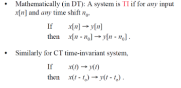

# 信号

自变量为时间，因变量为带你呀，声压等等

## 信号的分类

### 连续信号与离散信号(Continuous and Discrete)

- Continuous Time(CT) Signal: 连续时间信号
- Discrete Time(DT) Signal: 离散时间信号

#### 采样：将连续时间信号转换为离散时间信号

奈奎斯特采样定理：采样频率要大于信号频率的两倍

#### 重建：将离散时间信号转换为连续时间信号

- 零阶保持(zero-order hold)
- 线性插值(piecewise linear)

### 实信号与复信号(Real and Complex)

### 周期信号与非周期信号(Periodic and Aperiodic)

### 因果信号与非因果信号(Causal and Anti-causal)

- 因果信号：$x(t) = 0, t < 0$
- 非因果信号：$x(t) = 0, t > 0$

### 右边信号与左边信号(Right-sided and Left-sided)

- 右边信号：$x(t) = 0, t < T$
- 左边信号：$x(t) = 0, t > T$

### 有界信号与无界信号(Bounded and Unbounded)

### 偶信号与奇信号(Even and Odd)

所有信号都可以拆成偶信号与奇信号的叠加
$$
Ev\{x(t)\} = \frac{x(t) + x(-t)}{2} \\
Od\{x(t)\} = \frac{x(t) - x(-t)}{2}
$$

### 能量信号与功率信号(Energy and Power)

## 冲激信号与阶跃信号

### 冲激信号

$$
\delta(t) = \begin{cases}
0, & t \neq 0 \\
\infty, & t = 0
\end{cases}
$$
$$
\int_{-\infty}^{\infty} \delta(t) dt = 1
$$

### 阶跃信号

$$
u(t) = \begin{cases}
0, & t < 0 \\
1, & t \geq 0
\end{cases}
$$

### 冲激信号积分为阶跃信号

# 时间变换(Transformations of Time)

## 时间平移(Time Shift)

$$
x(t)\rightarrow x(t - t_0) \begin{cases}
    delayed, & t_0 > 0 \\
    advanced, & t_0 < 0
\end{cases}
$$

## 时间反转(Time Reversal)

$$
x(t) \rightarrow x(-t)
$$

## 时间缩放(Time Scaling)

$$
x(t) \rightarrow x(at) \begin{cases}
    compressed, & |a| > 1 \\
    stretched, & |a| < 1
\end{cases}
$$

# 系统

## 记忆系统与无记忆系统(with and without memory)

- 无记忆系统：输出只与当前时刻的输入有关
- 记忆系统：输出与当前时刻的输入以及之前的输入有关

## 因果系统与非因果系统(Causal and Noncausal)

### 因果系统

$t_0$时刻系统的输出只与$t_0$时刻之前的输入有关，系统无法预测未来输入

因果系统中，相同的输入$\Rightarrow$相同的输出

## 稳定系统与非稳定系统(Stable and Unstable)

## 线性时不变系统(Linear Time-Invariant System)

### 时不变系统(Time-Invariant)

时不变系统的行为与零点的选择无关，意味着相同的输入在不同的时间点输入系统，输出是相同的

时不变系统，当输入是周期的，输出也是周期的

### 线性系统(Linear System)

一个连续系统是线性的，如果满足以下两个性质：

- 叠加性：$x_1(t) \rightarrow y_1(t), x_2(t) \rightarrow y_2(t) \Rightarrow ax_1(t) + bx_2(t) \rightarrow ay_1(t) + by_2(t)$
- 齐次性：$x(t) \rightarrow y(t) \Rightarrow ax(t) \rightarrow ay(t)$