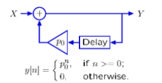

# 离散时间系统的多种表示

记录第一个数据和差分数据

# 差分方程

## Example

$$
y[n] = x[n] - x[n-1]
$$

$$
x[n] = \delta[n] = \begin{cases}
1, & n = 0 \\
0, & n \neq 0
\end{cases}\\
\delta[n]是最基础的信号(building-block signal)
$$

# Operator Notation

用R代表右移算子

$R \cdot x[n] = x[n-1]$

# Geometric Growth

单位冲激信号产生的响应系统可以用一个单一的极点表示

## 二阶系统