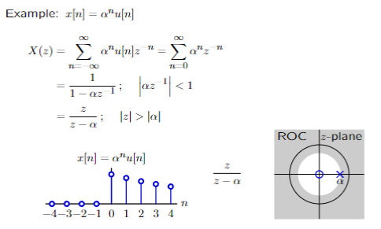
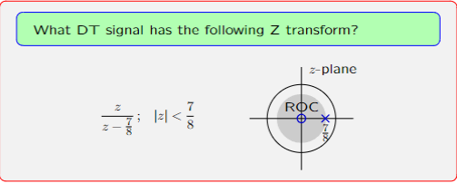
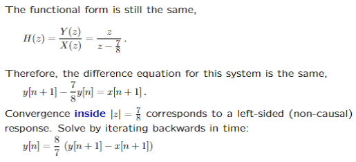
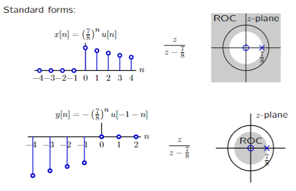
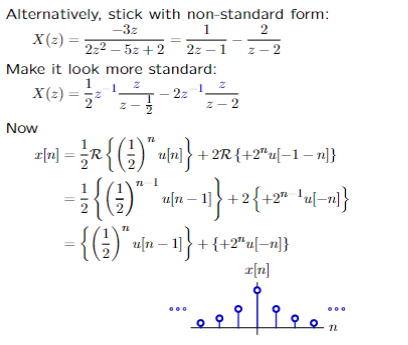
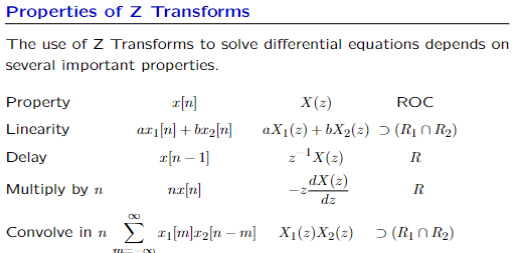

# Z变换

$$
H(z) = \sum_{n=-\infty}^{\infty} h[n] z^{-n}
$$

$$
H(\delta[n]) = 1
$$

## ROC

example:$X(z)=\frac{z}{z-\alpha};|z|>|\alpha|$

## 典型特征

$$
x[n]\leftrightarrow X(z)\\
x[n-1]\leftrightarrow z^{-1}X(z)\\
x[n+1]\leftrightarrow zX(z)\\
$$

# Example

> 注意定义域并不是圆外而是圆内！

# 标准形式

当遇到非标准形式时

# Z逆变换

$$
x[n] = \frac{1}{j2\pi} \oint_C X(z)z^{n-1}dz
$$

