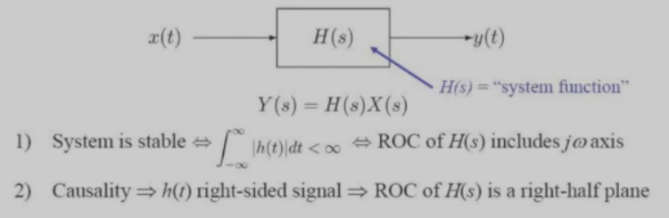
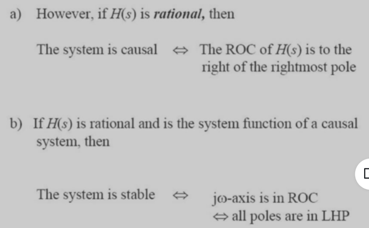
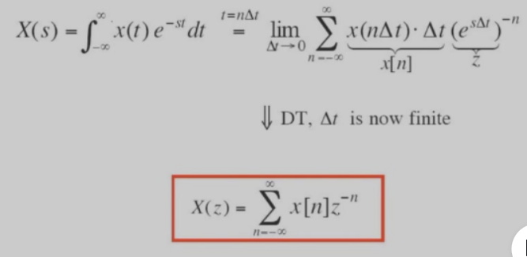
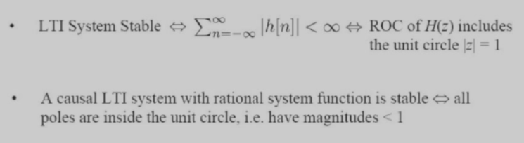
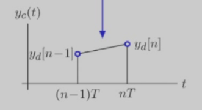

# 连续时间系统与离散时间系统

$$
\sum_{k=0}^N a_k\frac{d^ky(t)}{dt^k} = \sum_{k=0}^M b_k\frac{d^kx(t)}{dt^k}
$$

$$
\frac{d}{dt}\leftrightarrow s
\frac{d^k}{dt^k}\leftrightarrow s^k
$$

$$
Y(s) = H(s)X(s)
$$

$$
H(s) = \frac{\sum_{k=0}^Mb_k s^k}{\sum_{k=0}^Na_k s^k}
$$

# 连续时间系统

但如果H(s)的收敛域是右侧区域，并不能得到系统是因果的

# Z变换与拉普拉斯变换的联系

# 离散时间系统的稳定性

# 连续转离散

## 前向欧拉法

$$
\dot{y}(nT) = \frac{y((n+1)T) - y(nT)}{T} = \frac{y[n+1] - y[n]}{T}
$$

## 后向欧拉法

$$
\dot{y}((n+1)T) = \frac{y((n+1)T) - y(nT)}{T} = \frac{y[n+1] - y[n]}{T}
$$

## 梯形法

$$
y((n+\frac{1}{2})T) = \frac{y[n] + y[n+1]}{2}
$$

$$
\dot{y}((n+\frac{1}{2})T) = \frac{y[n+1] - y[n]}{T}
$$

