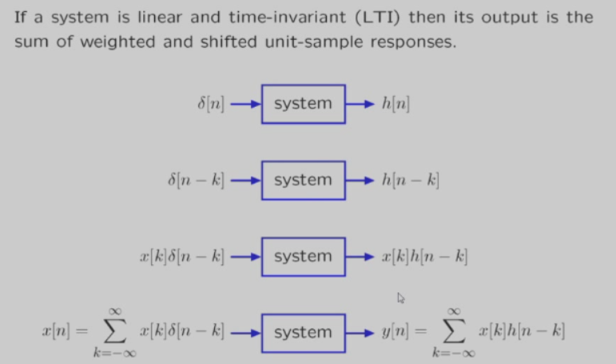
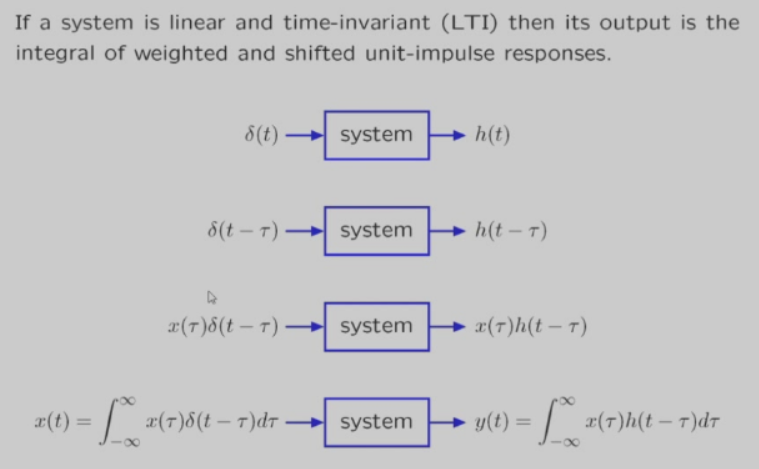
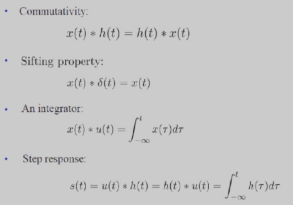

# 卷积

$$
y[n] = \sum_{k=-\infty}^{\infty} x[k] \cdot h[n-k] = x[n] * h[n]
$$

$$
y(t) = \int_{-\infty}^{\infty} x(\tau) \cdot h(t-\tau) d\tau = x(t) * h(t)
$$

# 卷积运算性质

# 线性时不变系统的特征

## 无记忆

$$
h(t) = 0, t < 0
$$

## 可逆性

$$
h(t)*h_1(t) = \delta(t)
$$

## 因果性

$$
h(t) = 0, t < 0
$$

## 稳定性

$$
\int_{-\infty}^{\infty} |h(t)| dt < \infty
$$