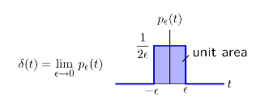
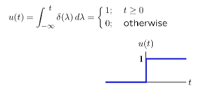
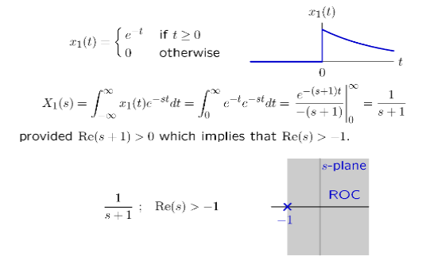
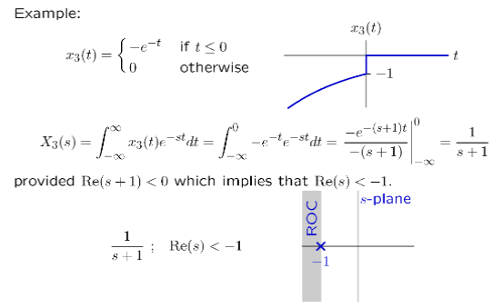
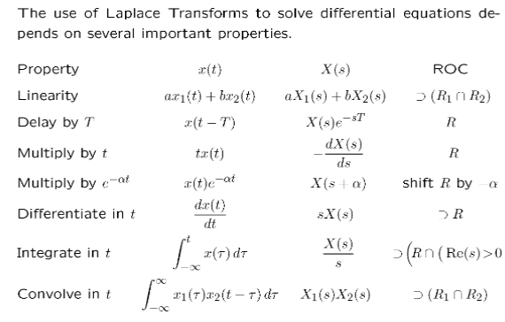

# DT Poles

$R\rightarrow \frac{1}{z}$，求$\frac{Y}{X}$分母的零点

# DT System A

$$
Y = AX \Leftrightarrow y(t) = \int_{-\infty}^{t}x(\tau)d\tau
$$

# CT Building-Block Signal

**Unit-Impulse Signal**

**Unit-Step Signal**

$$
\delta(t) \cdot A = u(t) 
$$

$$
A^n \cdot u(t) = \frac{1}{n!}t^{n}u(t)
$$

# CT Poles

$A\rightarrow \frac{1}{s}$，求$\frac{Y}{X}$分母的零点

# 拉普拉斯变换

$$
X(S) = \int x(t)e^{-st}dt
$$

## 两种形式

- $X(S) = \int_0^\infty x(t)e^{-st}dt$
- $X(S) = \int_{-\infty}^\infty x(t)e^{-st}dt$

## 左右侧拉普拉斯变换

右侧拉普拉斯变换

左侧拉普拉斯变换

> **注意s定义域！！！**

# 拉普拉斯变换的性质

## 微分性质

$$
\mathcal{L}\{x'(t)\} = sX(s) - x(0)
$$

更一般的

$$
\mathcal{L}\{x^{(n)}(t)\} = s^nX(s) - s^{n-1}x(0) - s^{n-2}x'(0) - \cdots - x^{(n-1)}(0)
$$

## Unit-Impulse Signal的拉普拉斯变换

$$
\mathcal{L}\{\delta(t)\} = 1
$$

## 常用性质

