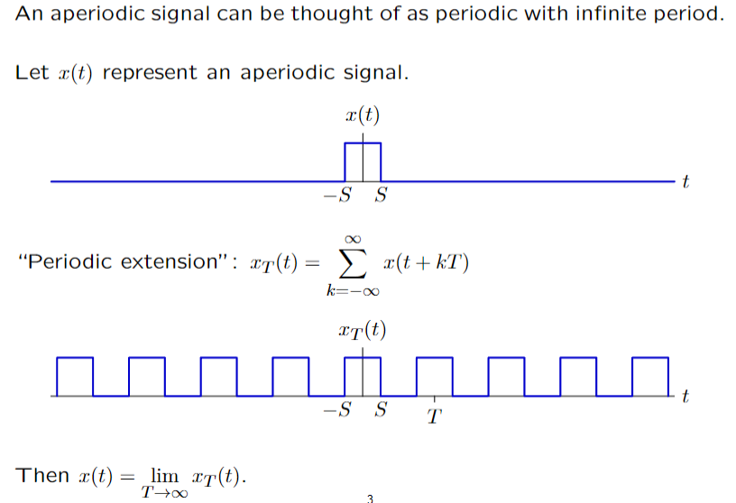
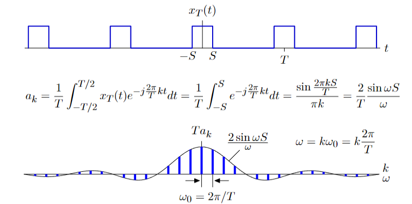
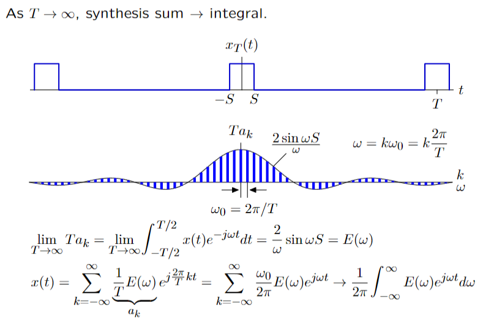
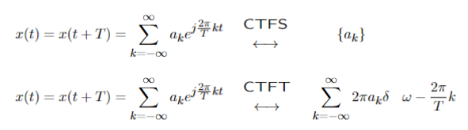

# 傅里叶变化

## 将非周期信号转为周期信号

$$
X_T(t) = \sum_{n=-\infty}^{+\infty} x(t+nT)
$$

## 对周期信号进行傅里叶变换

## 频域信号与时域信号的转换

$$
X(j\omega) = \int_{-\infty}^{+\infty} x(t)e^{-j\omega t}dt
$$
$$
X(t) = \frac{1}{2\pi} \int_{-\infty}^{+\infty} X(j\omega)e^{j\omega t}d\omega
$$

# 傅里叶变化与拉普拉斯变换的关系

$$
X(j\omega) = \int_{-\infty}^{+\infty} x(t)e^{-j\omega t}dt = X(s)|_{s = j\omega}
$$

# 傅里叶变换的对偶性

$$
x_1(t) = f(t) \leftrightarrow X_1(j\omega) = g(\omega)
$$
$$
\Rightarrow x_2(t) = g(t) \leftrightarrow X_2(j\omega) = 2\pi f(-\omega)
$$

## 冲激函数的傅里叶变换

$$
\delta(t-T) \leftrightarrow e^{-j\omega T}
$$

$$
\Rightarrow e^{-jtT} \leftrightarrow 2\pi \delta(\omega + T)\\
\Rightarrow e^{-j\omega_0 t} \leftrightarrow 2\pi \delta(\omega + \omega_0)\\
$$

# 傅里叶级数与傅里叶变换的区别

