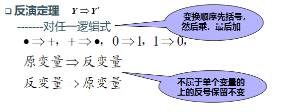

# 逻辑代数基本定理

## 代入定理

在任何一个包含A的逻辑等式中，用任意一个逻辑式代入A，所得的逻辑等式仍然成立。

## 反演定理

# 逻辑函数

## 逻辑函数的表示方法

- 真值表
- 逻辑式
- 逻辑图
- 波形图
- 卡诺图
- 计算机软件中的描述方式

## 各表现形式相互转换

## 逻辑函数的两种标准形式

### 最小项之和

- 在输入变量任一取值下，有且仅有一个最小项的值为1
- 全体最小项之和为1
- 任何两个最小项之积为0

利用公式$A + A' = 1$，可将任何一个函数化为$\Sigma m_i$

### 最大项之积

- 在输入变量任一取值下，有且仅有一个最大项的值为0
- 全体最大项之积为0
- 任何两个最大项之和为1

$$
Y' = \Sigma m_i \Rightarrow Y = (\Sigma m_i)' = \Pi M_i
$$

## 用卡诺图化简函数

- 用卡诺图表示逻辑函数
- 找出可合并的最小项
- 化简后的乘积项相加