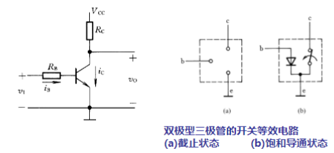
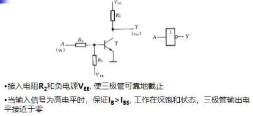
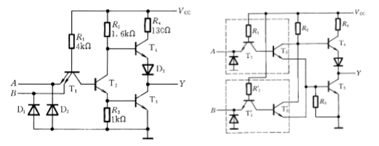
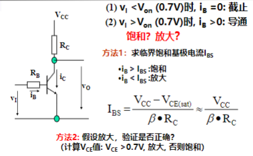

# 双极型三极管

TTL 流控器件

## 双极型三极管的基本开关电路

## 三极管非门

# TTL反相器

见pdf7-18，27-28

## 工作原理定量分析

$$
    V_i = 0.2 V\\
    i_{b1} = \frac{V_{cc}-V_{BE}}{R1} = 1.1mA >i_{BS} \\
    V_i = 3.6 V，T1倒置\\ 
    V_B = 2.1V,V_C = 1.4V,V_E = 3.6V\\
$$

## TTL与非门/或非门

# 三极管的基本开关电路的计算

