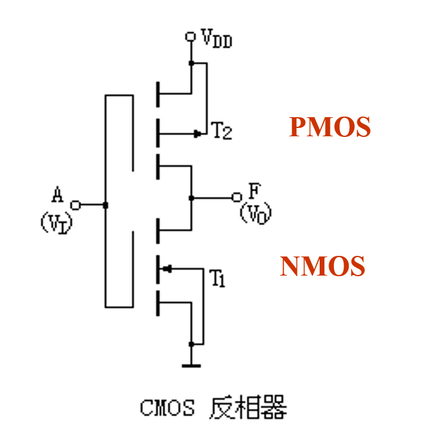
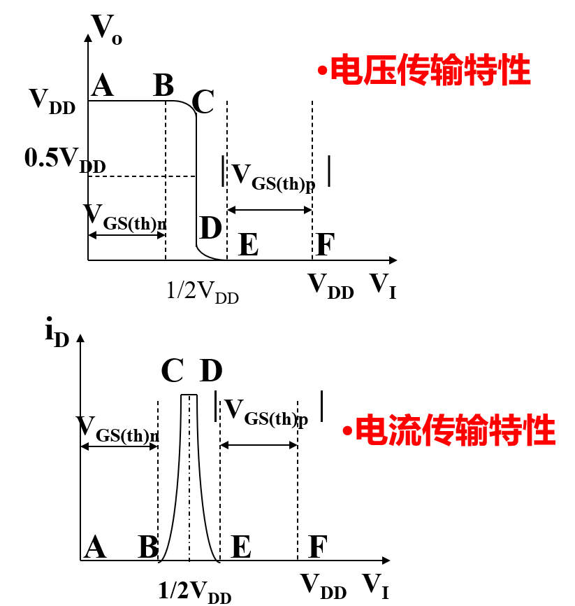
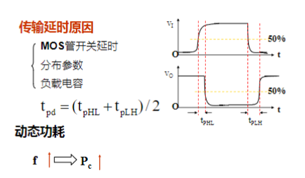
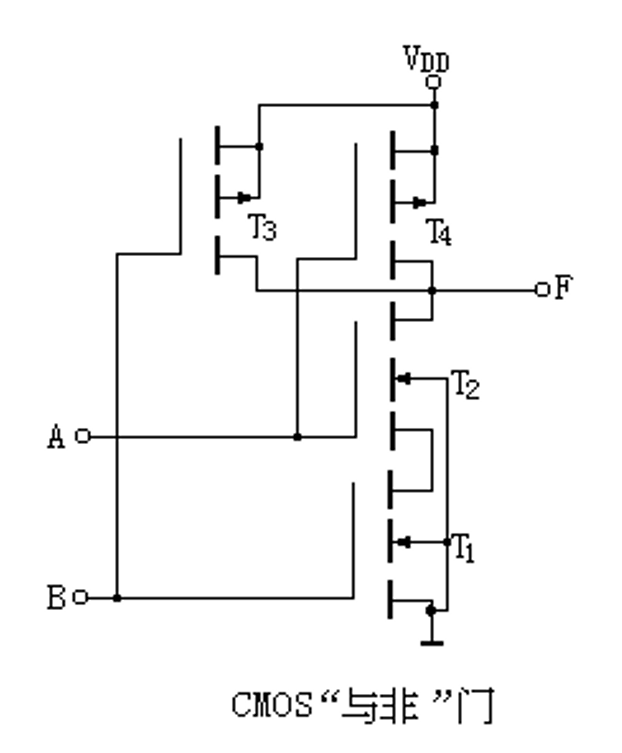
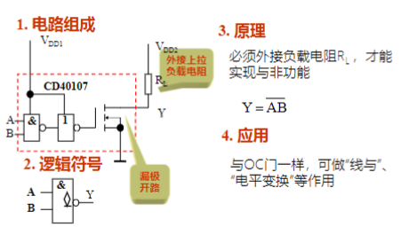
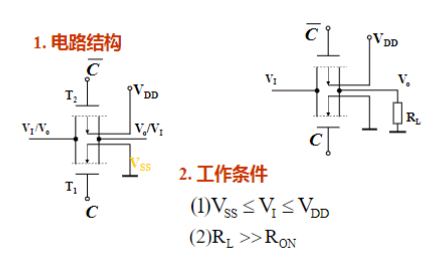
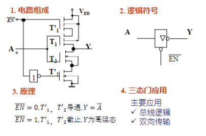

# CMOS反相器

## 工作原理

- 输入为低电平时，T1截止，T2导通，输出为高电平
- 输入为高电平时，T1导通，T2截止，输出为低电平

## 电压传输特性和电流传输特性

## CMOS反相器传输延时时间

# CMOS门电路

## 与非门

## 或非门

## 漏极开路门电路（OD门）

## CMOS传输门和双向开关

- C = 0,开关断开
- C = 1,开关导通

## CMOS三态门

高阻态：接入下一级电路无任何影响

# 门级逻辑电路

- 非门
- 与非门
- 或非门

## MOSFET连线规则

- nFET仅用来传导逻辑0（下拉部分都是nmos）
- pFET仅用来传导逻辑1（上拉部分都是pmos）

## 三态缓冲器

当多个端口同时连接到一条公共总线时通常会使用三态缓冲器，只有一个端口可以连接到总线，其它端口均断开

## 多路选择器