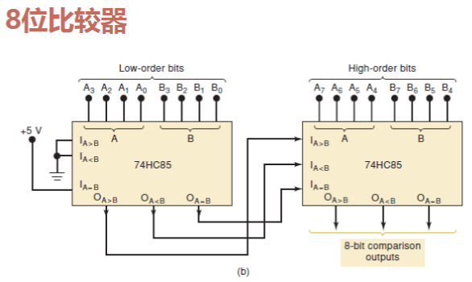
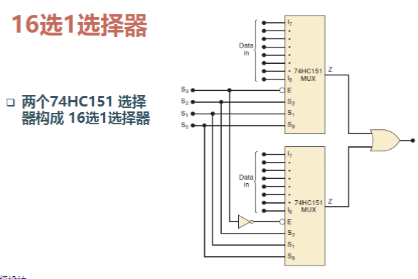
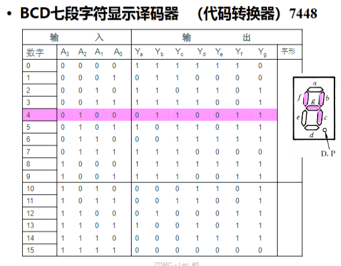
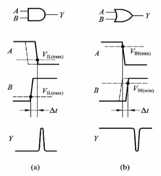
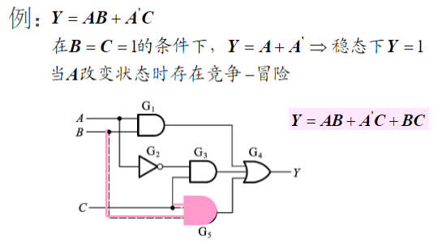

# 比较器级联

其中级联输入表示低位比较器的输出，在高位比较相等时发挥作用

# 数据选择器级联

S3表示选择哪一片数据选择器，S2到S0表示选择选定数据选择器的哪一位输出

# 显示译码器

# 组合电路的竞争-冒险

- 竞争：两个输入同时向相反的逻辑电平变化，称为存在“竞争”
- 竞争-冒险：因竞争而可能在输出产生尖峰脉冲的现象

## 消除竞争-冒险现象的方法

- 接入滤波电容：尖峰脉冲很窄，用很小的电容就可将尖峰削弱到$V_{TH}$以下
- 引入选通脉冲：取选通脉冲作用时间在电路达到稳定之后，使得P高电平期间信号不会出现尖峰脉冲
- 修改逻辑设计
