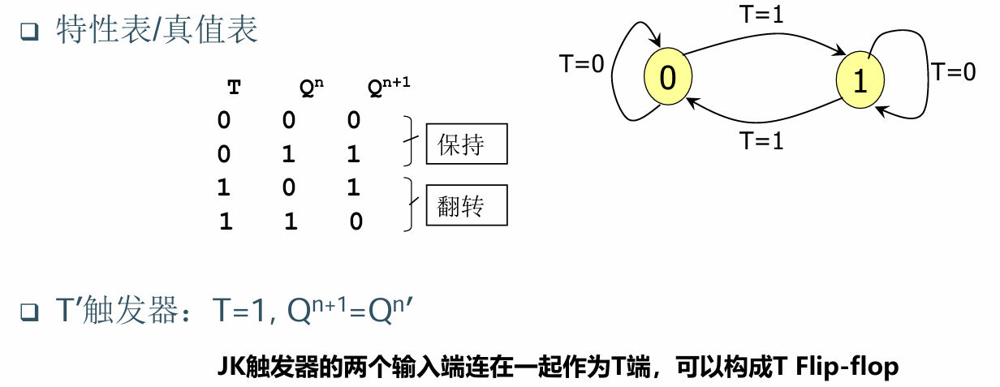

# 触发器分类

## RS锁存器

特征方程

$$
Q^{n+1} = S + R' \cdot Q^n
$$

## JK触发器

特征方程

$$
Q^{n+1} = J \cdot (Q^n)' + K' \cdot Q^n
$$

## T触发器

特征方程

$$
Q^{n+1} = T \cdot (Q^n)' + T' \cdot Q^n
$$

## D触发器

特征方程

$$
Q^{n+1} = D
$$

# 脉冲触发

高电平读取，低电平变化

# 边沿触发

上升沿采样的输入，上升沿后发生变化

下降沿采样的输入，下降沿后发生变化