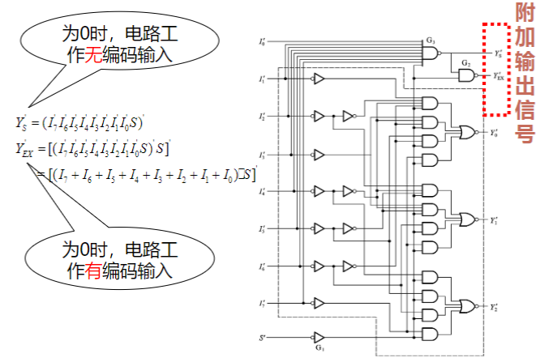
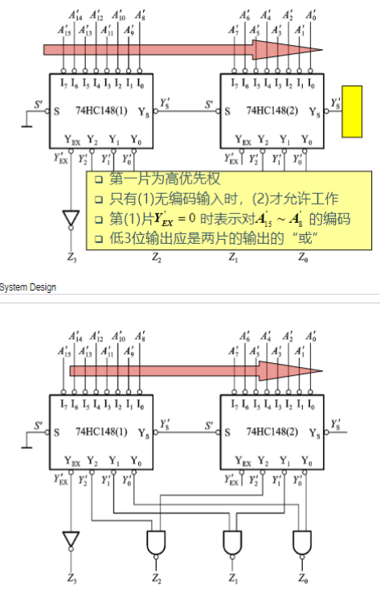

# 编码方式

## 3bit二进制码和格雷码

$$
G_2 = B_2\\
G_1 = B_1 \oplus B_2\\
G_0 = B_0 \oplus B_1
$$

# 组合逻辑电路的特点

## 功能

任意时刻的输出仅取决于该时刻的输入，没有反馈

## 电路结构

不含存储单元

# 组合逻辑电路的设计方法

- 逻辑抽象
- 写出函数的最简表达式
- 用逻辑门电路或集成电路模块实现表达式

# 编码器

编码：将输入的每个高/低电平信号变成一个对应的二进制代码

## 普通编码器

特点：任何时刻只允许输入一个编码信号

## 优先编码器

特点：允许同时输入两个以上的编码信号，但只对其中优先权最高的一个进行编码

### 两片8-3优先编码器组合称16-4优先编码器

# 译码器

译码：将每个输入的二进制代码译成对应的输出高低电平信号

## 用译码器设计组合逻辑电路

### 基本原理

n位二进制译码器给出n变量的全部最小项

将n位二进制译码输出的最小项组合起来，可获得任何形式的输入变量不大于n的组合函数