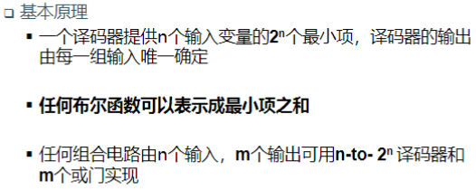
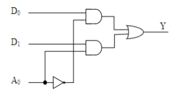
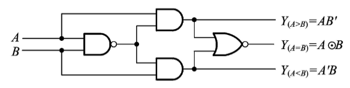

# 用译码器设计组合逻辑电路

# 数据选择器

- 数据输入线：$D_0, D_1$
- 选择线：$A_0$
- 输入线：$Y$

$$
Y = A_0 \cdot D_1 + \overline{A_0} \cdot D_0
$$

# 半加器

- 输入线：$A, B$
- 输出线：$S, C$

$$
S = A \oplus B\\
C = A \cdot B
$$

# 全加器

- 输入线：$A, B, C_{in}$
- 输出线：$S, C_{out}$

$$
S = A \oplus B \oplus C_{in}\\
C_{out} = A \cdot B + C_{in} \cdot (A \oplus B)
$$

## 用加法器设计组合电路

### 基本原理

- 函数可变换成输入变量与输入变量相加
- 函数可变换成输入变量与常量相加

# 数值比较器

- $A>B\Rightarrow AB'=1 \Rightarrow Y_{A>B} = AB'$
- $A<B\Rightarrow A'B=1 \Rightarrow Y_{A<B} = A'B$
- $A=B\Rightarrow Y_{A=B} =A \odot B$

## 多位数值比较器

从高位比起，只有高位相等，才比较下一位