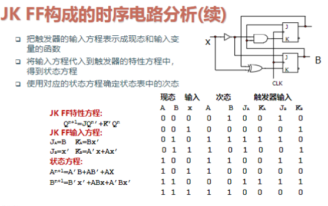

# 时序方法术语

- 建立时间：在时钟时间之前输入必须稳定的最小时间(Tsu)
- 保持时间：在时钟事件后输入必须保持稳定的最小时间(Th)

# 处理异步输入

- 在电路的边界同步
- 扇出同步信号

# 时序逻辑电路

- 时序电路通常包含组合电路和存储电路两部分
- 存储电路的输出反馈到组合电路的输入端
- 输出信号不仅取决于当时的输入信号，还与以前的输入有关

## 时序电路分类

- 同步时序电路
- 异步时序电路

## 有限状态机FSM分类

- Mealy型：输出信号取决于存储电路状态和输入变量
- Moore型：输出信号只是存储电路现态的函数，输出与时钟同步

# JK FF

