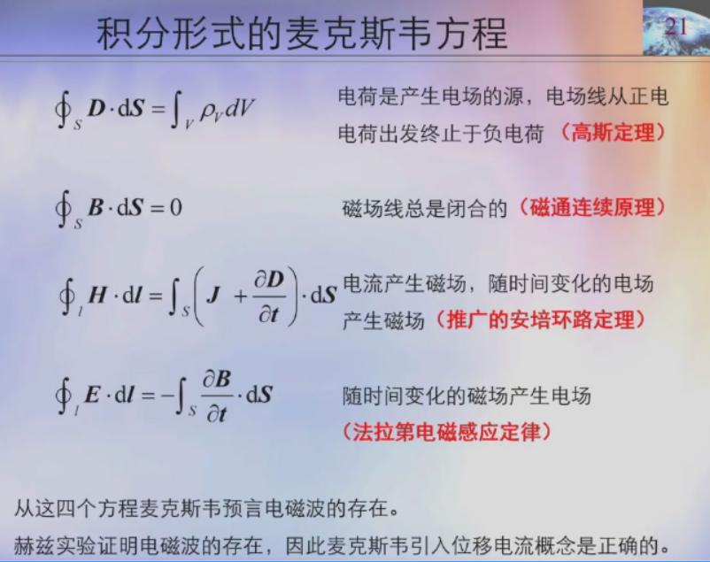
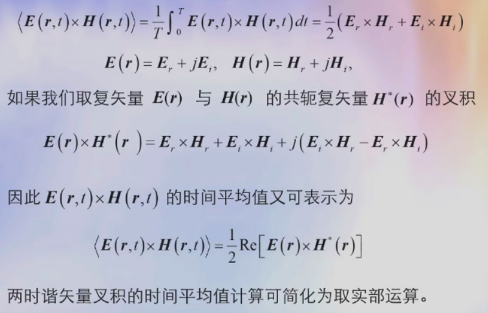

# 电荷与电流是产生电磁场的源

## 电偶极子用电距p表示

$$
p = q \cdot d
$$

## 磁偶极子用磁距m表示

$$
m = I \cdot S \cdot z_0 \\
其中，z_0为面的单位矢量
$$

# 电磁运动规律的实验总结

## 高斯定理

电通量密度线数等于闭曲面包围的体积V中的电荷Q

$$
\oint_S D \cdot dS = Q = \int_V \rho_v dV
$$

## 磁通连续性原理

磁场线总是一闭合曲线，因此穿出任一闭曲面磁场线数总是等于零

$$
\int_S B \cdot dS = 0
$$

## 法拉第定理

$$
\oint_l E \cdot dl = - \int_S \frac{\partial B}{\partial t} \cdot dS
$$

## 推广的安培定理

$$
\oint_l H \cdot dl = \int_S (J+\frac{\partial D}{\partial t} )\cdot dS
$$

# 积分形式的麦克斯韦方程

# 连续波与脉冲波

波有瞬态波和随时间作简谐变化的连续波之分，前者作为波源的扰动局限于一个很短时间内，而后者为连续的简谐振荡源激励

## 脉冲波类型

- Delta电磁脉冲（冲激）
- Gauss电磁脉冲（正态）
- 雷达波电磁脉冲（方波）
- 强电磁脉冲(核爆脉冲  雷电脉冲)
- 超宽带脉冲

## 连续波特征

随时间作简谐变化的连续波
$$
A(z,t) = A_0 \cos(\omega t - k z + \varphi)
$$
是空间坐标z和时间t的函数

### 在时间域中看波

周期$T = \frac{2\pi}{\omega}$

### 在空间域中看波

波长$\lambda = \frac{2\pi}{k}$

### 波的速度

$$
v = \frac{\omega}{k} = f \lambda
$$

# 时谐标量波的复数表示

$$
u(z,t) = U_0 \cos(\omega t - k z + \varphi_{0u}) \leftrightarrow U = U_0 e^{j\varphi}\\
相位\varphi = -k z+\varphi_{0u}
$$

## 运算法则

$$
u(z,t) \leftrightarrow U\\
v(z,t) \leftrightarrow V\\
$$

### 加法
$$
u + v \leftrightarrow U + V
$$

### 积分微分
$$
\frac{\partial}{\partial t}u (z,t)\leftrightarrow j\omega U\\
\int u(z,t) dt \leftrightarrow \frac{U}{j\omega}\\
$$

### 两矢量乘积的时间平均值

$$
<u(z,t)v(z,t)> = \frac{1}{2}U_0V_0cos(\varphi_u-\varphi_v)\\
<u(z,t)v(z,t)> = \frac{1}{2}Re(UV^*)
$$

### 两矢量叉积的时间平均值

