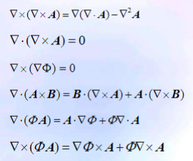

# 不同波段电磁波的传播特性及其应用

- 地波
- 天波
- 空间波

# 电荷与电流分布的模型

## 电荷分布的模型

- 体电荷模型和体电荷密度$\rho_V$
- 面电荷模型和面电荷密度$\rho_S$
- 线电荷模型和线电荷密度$\rho_L$
- 点电荷模型和点电荷体系

## 电流分布的模型

- 体电流密度$\vec{J}$和体电流元$\vec{J}dV$
- 面电流密度$\vec{J}_S$和面电流元$\vec{J}_SdS$
- 线电流密度$\vec{I}$和线电流元$\vec{I}dl$

# 积分与微分形式的麦克斯韦方程

## 微分形式

$$
\begin{aligned}
\nabla \cdot \vec{D} &= \rho_V \\
\nabla \times \vec{E} &= -\frac{\partial \vec{B}}{\partial t} \\
\nabla \cdot \vec{B} &= 0 \\
\nabla \times \vec{H} &= \vec{J} + \frac{\partial \vec{D}}{\partial t}
\end{aligned}
$$

## nabla算子的运算

$$
\nabla = \left(\frac{\partial}{\partial x}, \frac{\partial}{\partial y}, \frac{\partial}{\partial z}\right)
$$

# 标量、矢量与场

- 标量：只有大小，没有方向
- 矢量：有大小和方向

## 场

如果在空间域$\Omega$上，每一点都存在一确定的物理量A，我们就说场域$\Omega$上存在由场量A构成的场

## 两矢量的矢积

$$
A = (A_x, A_y, A_z), B = (B_x, B_y, B_z)\\
A \times B = \left|
\begin{array}{ccc}
\vec{i} & \vec{j} & \vec{k} \\
A_x & A_y & A_z \\
B_x & B_y & B_z
\end{array}
\right|
$$

## 等值面、方向导数与梯度

- 等值面：标量场$\Phi$中数值相同的点构成的曲面
- 方向导数：场在指定方向变化率称为场在该方向的方向导数
- 梯度：最大方向导数

### 梯度

梯度$grad \Phi = \nabla \Phi$

梯度在任意方向的投影就是该方向的变化率

## 矢量场通量

通量$\Psi = \int_S \vec{A} \cdot d\vec{S}$

## 散度

定义通量的体密度称为矢量场A的散度
$$
div \vec{A} =\lim_{\Delta V \rightarrow 0}\frac{\oint_S \vec{A} \cdot d\vec{S}}{\Delta V} =\nabla \cdot \vec{A}
$$

### 散度定理

$$
\int_V \nabla \cdot \vec{A} dV = \oint_S \vec{A} \cdot d\vec{S}
$$

矢量$\vec{A}$沿闭曲面的面积分$\oint_s \vec{A} \cdot d\vec{S}$等于散度的体积分

## 拉普拉斯算符$\nabla^2$

$$
\nabla^2 \Phi = \nabla \cdot \nabla = \frac{\partial^2}{\partial x^2} + \frac{\partial^2}{\partial y^2} + \frac{\partial^2}{\partial z^2}
$$

$$
div(grad \Phi) = \nabla \cdot \nabla \Phi = \frac{\partial^2 \Phi}{\partial x^2} + \frac{\partial^2 \Phi}{\partial y^2} + \frac{\partial^2 \Phi}{\partial z^2}
$$

## 环量

矢量场A在有向闭合曲线上的线积分
$$
\Gamma = \oint_L \vec{A} \cdot d\vec{l}
$$
定义位矢量场A沿有向闭合曲线l的环量

### 环量面密度

$$
\lim_{\Delta S \rightarrow M}\frac{\Delta \Gamma}{\Delta S} = \lim_{\Delta S \rightarrow 0}\frac{\oint_L \vec{A} \cdot d\vec{l}}{\Delta S}
$$

### 旋度

$$
(Curl A) \cdot \vec{n} = \lim_{\Delta S \rightarrow 0}\frac{\oint_L \vec{A} \cdot d\vec{l}}{\Delta S}
$$

矢量场A的旋度Curl A在空间某一点给定方向的投影就是该方向的环量面密度

$$
Curl \vec{A} = \nabla \times \vec{A}
$$

### 斯托克斯定理

$$
\oint_l \vec{A} \cdot d\vec{l} = \oint_S (\nabla \times \vec{A}) \cdot d\vec{S}
$$

矢量A沿曲线C的线积分（环量）等于A的旋度穿过曲线C包围的面积S的面积分

## 亥姆霍兹定理

如果在体 V 内矢量场 A 的散度和旋度已知，在 V 的边界 S 上 A 的值也已知，则在 V 内任意一点 A 的值能唯一确定。

据此定理，可以将任一矢量场 A 分解为一个无旋场与一个无源场之和

## 矢量运算的几个恒等关系

