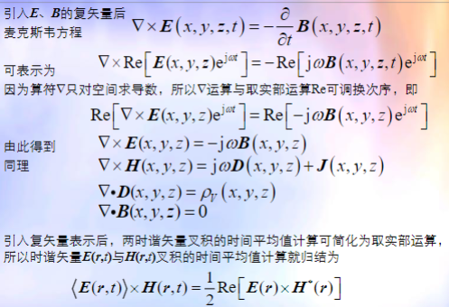
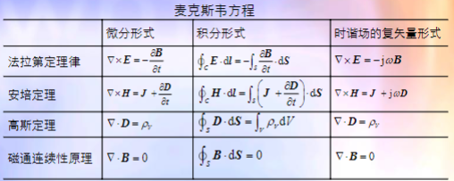

# 从积分形式到微分形式的麦克斯韦方程组
$$
\oint_l \vec{E} \cdot d\vec{l} = \int_S \nabla \times \vec{E} \cdot d\vec{S} = -\int_S \frac{\partial \vec{B}}{\partial t} \cdot d\vec{S}\\
\Rightarrow \nabla \times \vec{E} = -\frac{\partial \vec{B}}{\partial t}\\
$$
$$
\oint_l \vec{H} \cdot d\vec{l} = \int_S \nabla \times \vec{H} \cdot d\vec{S} = \int_S (J + \frac{\partial D}{\partial t})d \vec{S}\\
\Rightarrow \nabla \times \vec{H} = J + \frac{\partial D}{\partial t}\\
$$
$$
\oint_S \vec{D} \cdot d\vec{S} = \int_V \nabla \cdot \vec{D} dV = \int_V \rho_v dV\\
\Rightarrow \nabla \cdot \vec{D} = \rho_v\\
$$
$$
\oint_S \vec{B} \cdot d\vec{S} = \int_V \nabla \cdot \vec{B} dV = 0\\
\Rightarrow \nabla \cdot \vec{B} = 0
$$

# 时谐场量的复数表示

$$
\vec{E}(x,y,z,t) = Re[\vec{E}(x,y,z)e^{j\omega t}]\\
\vec{H}(x,y,z,t) = Re[\vec{H}(x,y,z)e^{j\omega t}]\\
\vec{B}(x,y,z,t) = Re[\vec{B}(x,y,z)e^{j\omega t}]\\
\vec{D}(x,y,z,t) = Re[\vec{D}(x,y,z)e^{j\omega t}]\\
\vec{J}(x,y,z,t) = Re[\vec{J}(x,y,z)e^{j\omega t}]\\
\vec{\rho_v}(x,y,z,t) = Re[\vec{\rho_v}(x,y,z)e^{j\omega t}]\\
$$

$$
\frac{\partial}{\partial t} \leftrightarrow j\omega
$$

## 复矢量形式的麦克斯韦方程组

# 麦克斯韦方程

# 电流连续性原理

$$
\nabla \cdot (\nabla \times \vec{E}) = \nabla \cdot (J + \frac{\partial \vec{D}}{\partial t})\\
\nabla \cdot \vec{J} + \frac{\partial \rho_v}{\partial t} = 0
$$

流出体积元的电流等于体积元内电荷随时间的减少率

# 麦克斯韦方程+物质本构关系（一组自洽方程）

麦克斯韦方程、电荷守恒与电流连续方程组中独立的方程是

$$
\begin{cases}
    \nabla \times \vec{E} = -\frac{\partial \vec{B}}{\partial t}\\
    \nabla \times \vec{H} = J + \frac{\partial D}{\partial t}\\
    \nabla \cdot \vec{J} = - \frac{\partial \rho_v}{\partial t} 
\end{cases}
$$

物质本构关系

$$
\begin{cases}
    \vec{D} = \epsilon \vec{E}\\
    \vec{B} = \mu \vec{H}\\
    \vec{J} = \sigma \vec{E}\\
\end{cases}
$$

## 物质可以按$\epsilon、\mu、\sigma$进行分类

