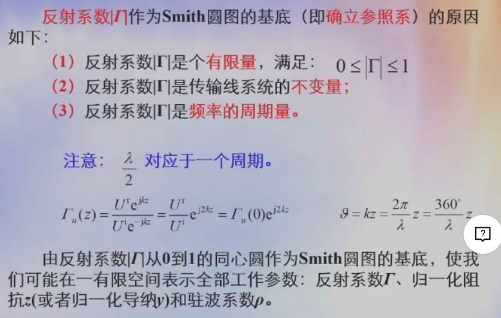
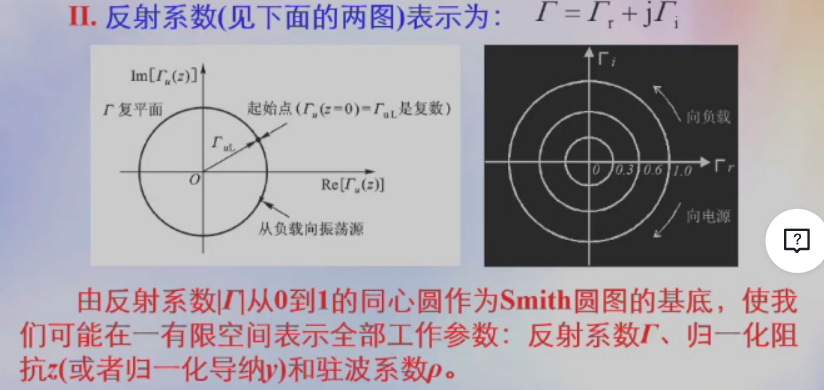
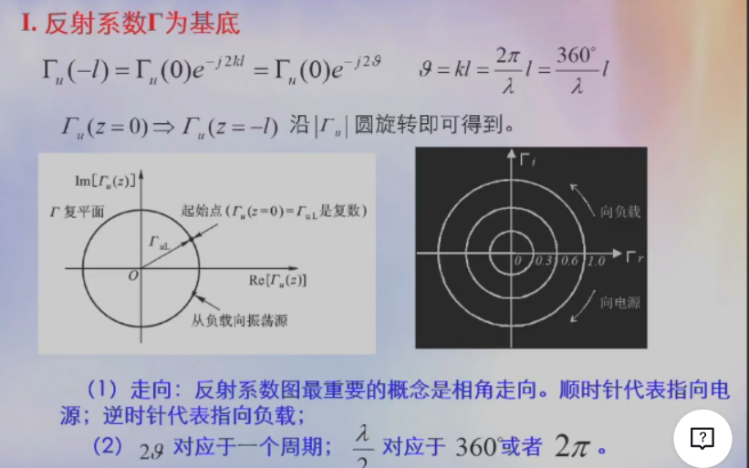
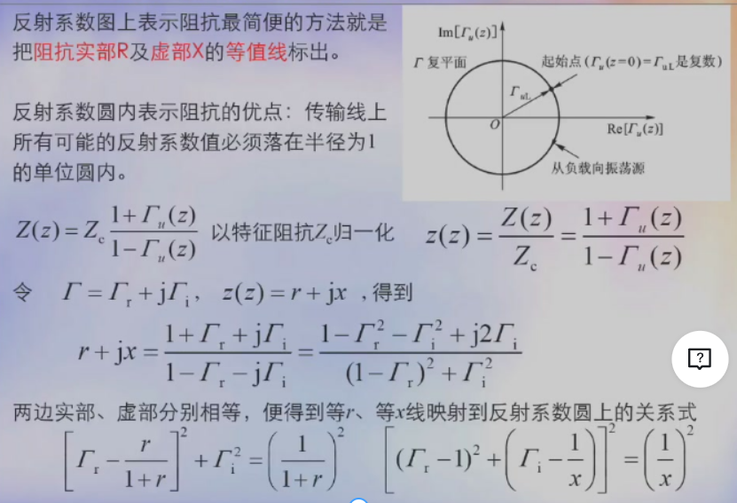
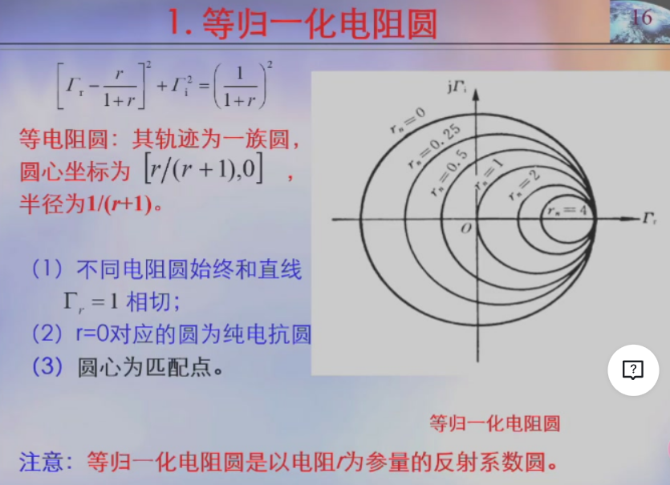
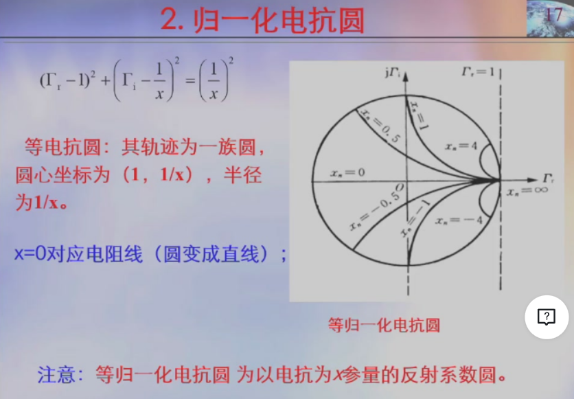
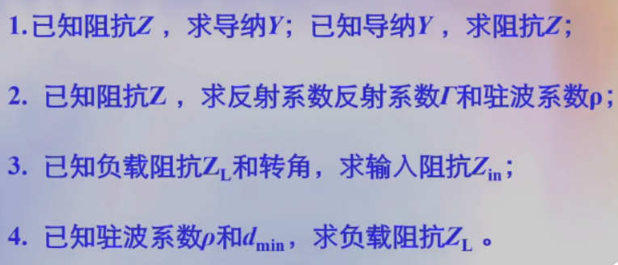

# 传输线圆图的基本思想

- 特征参数归一化
- 以系统不变量作为Smith圆图的基底
- 把归一化的阻抗（或导纳），驻波比套覆在反射系数圆上的集成思想

## 特征归一化

- 阻抗归一化$z(z)=\frac{Z(z)}{Z_c}=\frac{1+\Gamma_u(z)}{1-\Gamma_u(z)}$
- 电长度归一化

阻抗归一化，使得所有结构的阻抗都通用；电长度的归一化，使得所有频率都通用

## 确立参照系

## 把阻抗覆盖在$|\Gamma|$圆上的集成思想

对于归一化阻抗，我们写成
$$z(z) = r +jx$$
其中r，x分别为归一化的电阻和电抗

# Smith圆图的基本构成

- 反射系数为基底
  
- 将归一化阻抗集成到反射系数圆上

## 等r线与等x线

# 传输线经过$\lambda/4$阻抗变为导纳或相反

# Simith圆图基本功能

# 阶跃电压作用下的传输线