# 从无源空间的麦克斯韦方程到波动方程

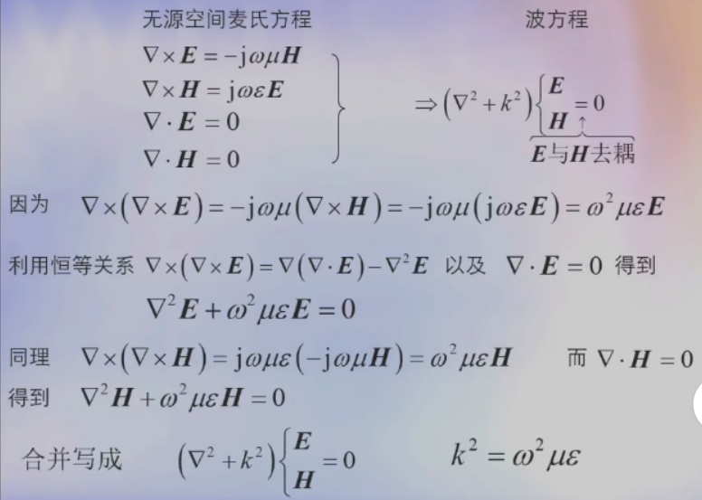

$$
k = \omega^2\mu\epsilon
$$

# 算符$\nabla$对$e^{-jkr}$的作用

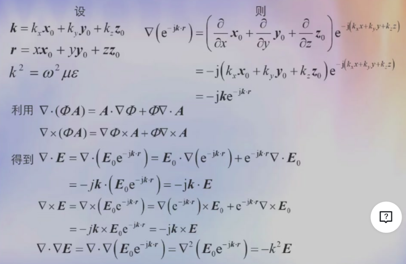

# 分离变量法解波动方程

矢量波方程$(\nabla^2+k^2)\begin{cases}
    E\\
    H
\end{cases}=0$可化简到解$(\nabla^2+k^2)\phi(x,y,z)$

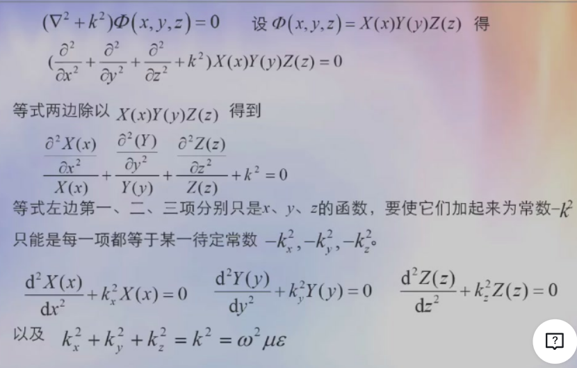

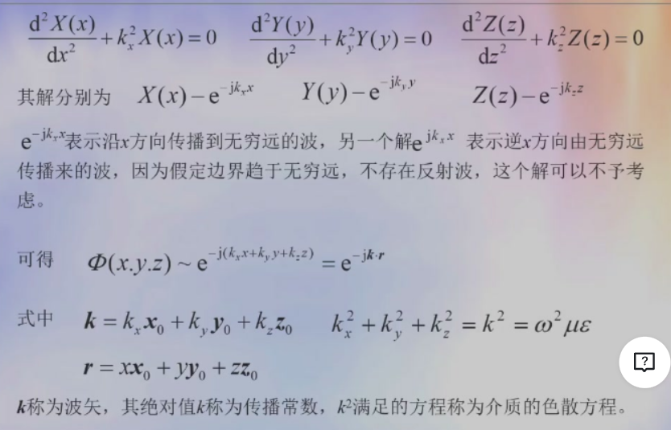

# 边界趋于无穷远时无源、简单介质中波方程的解

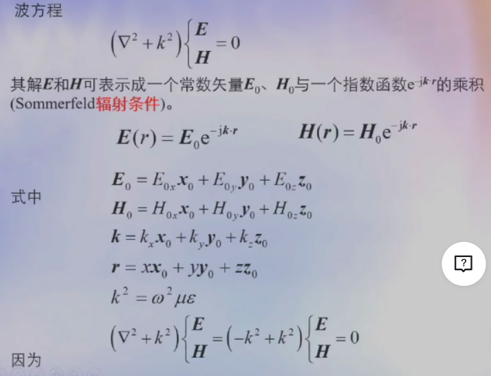

## 解的内涵

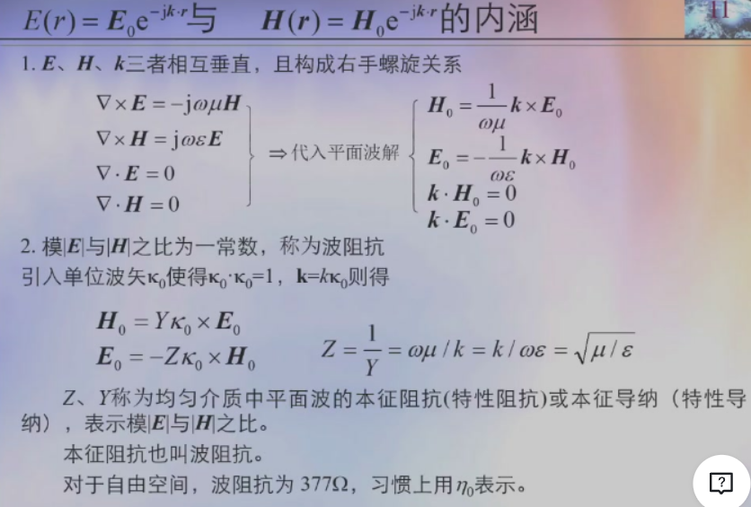

在与$\vec{k}$垂直的平面内，波的相位处处相等

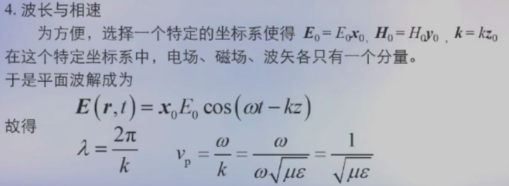

# 极化

- 电场矢量末端点运动轨迹是一条直线，称为线性极化波
- 轨迹是一个圆，称为圆极化波
- 轨迹是一个椭圆，称为椭圆极化波

## 波的极化的判定

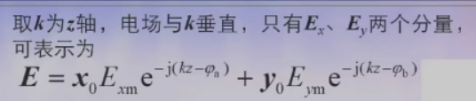

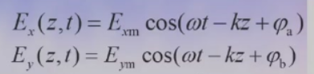

- $\varphi =\varphi_b-\varphi_a = 0 或\pi$，线性极化波
- $\varphi =\varphi_b-\varphi_a = \pm\frac{\pi}{2},A =\frac{E_{ym}}{E_{xm}} = 1$，圆极化波
- $\varphi =\varphi_b-\varphi_a = \pm\frac{\pi}{2},A =\frac{E_{ym}}{E_{xm}} \neq 1$，椭圆极化波

# 有耗介质中的平面波

波在传播方向幅度按指数衰减，即波的传播方向与衰减的方向一致

复数介电系数$\widetilde{\epsilon} = \epsilon-j\frac{\sigma}{\omega}$

## 有耗介质中的麦克斯韦方程

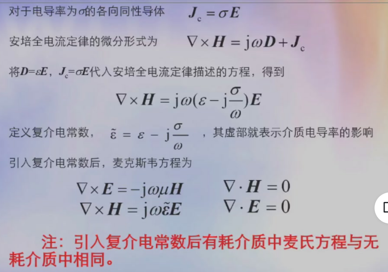

引入复介电常数后有耗介质中麦氏方程与无耗介质中相同

## 有耗介质中波方程及其解

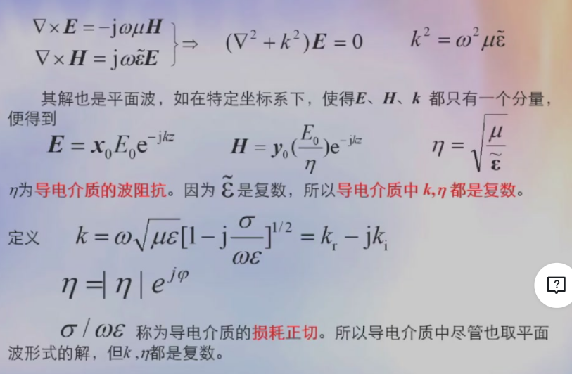

## 有耗介质中平面波解的特点

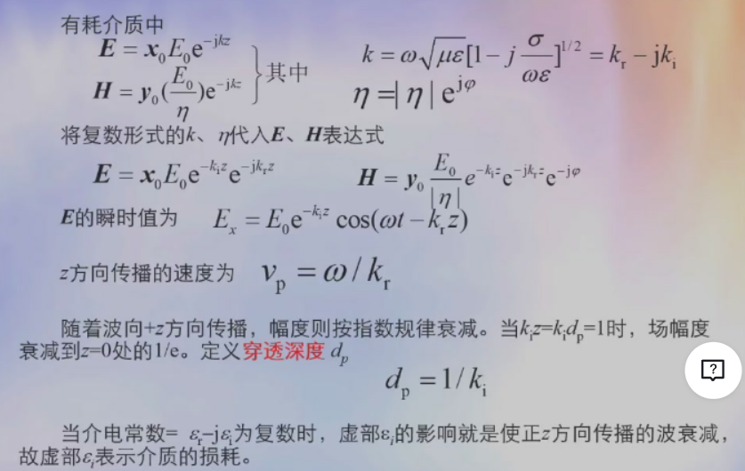

# 电导率很小与很大的的介质

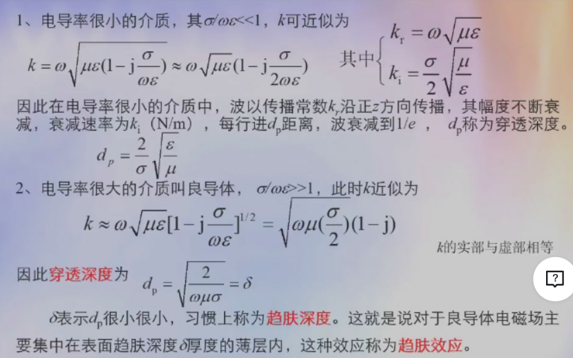

理想导体电导率趋于无穷大，趋肤深度趋于0

理想导体内没有电磁场