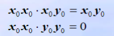
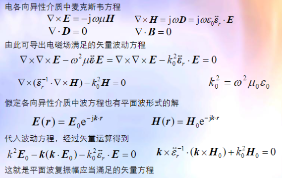
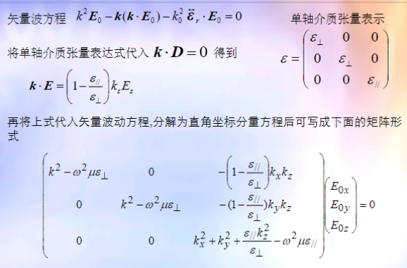
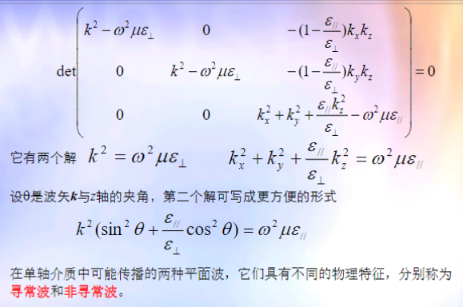
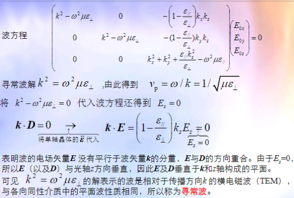
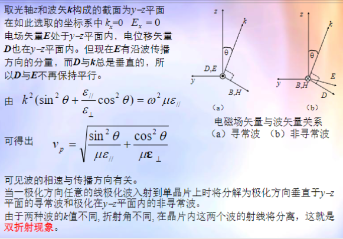

# 各向异性介质

$$
\begin{bmatrix}
    D_x \\
    D_y \\
    D_z
\end{bmatrix} = \begin{bmatrix}
    \varepsilon_{xx} & \varepsilon_{xy} & \varepsilon_{xz} \\
    \varepsilon_{yx} & \varepsilon_{yy} & \varepsilon_{yz} \\  
    \varepsilon_{zx} & \varepsilon_{zy} & \varepsilon_{zz}
\end{bmatrix} \begin{bmatrix}
    E_x \\
    E_y \\
    E_z
\end{bmatrix}
$$

$$
\begin{bmatrix}
    B_x \\
    B_y \\
    B_z
\end{bmatrix} = \begin{bmatrix}
    \mu_{xx} & \mu_{xy} & \mu_{xz} \\
    \mu_{yx} & \mu_{yy} & \mu_{yz} \\  
    \mu_{zx} & \mu_{zy} & \mu_{zz}
\end{bmatrix} \begin{bmatrix}
    H_x \\
    H_y \\
    H_z
\end{bmatrix}
$$

# 并矢

$$
\dot{C} = (A_xx_0 + A_yy_0 + A_zz_0)(B_xx_0 + B_yy_0 + B_zz_0) \\
= A_xB_xx_0x_0 + A_xB_yx_0y_0 + A_xB_zx_0z_0 +\\ A_yB_xx_0y_0 + A_yB_yy_0y_0 + A_yB_zy_0z_0 +\\ A_zB_xx_0z_0 + A_zB_yz_0y_0 + A_zB_zz_0z_0
$$

并矢的一次标积运算法则时夹在中间两个单位矢量按标积运算

并矢的二次标积运算法则时夹在中间两个单位矢量按标积运算，剩下的两个单位矢量再进行一次标积运算

# 电各向异性介质中的波方程

电各向异性介质中D，H，k三者相互垂直

电各向异性介质中D与E不再平行

# 单轴介质的色散方程

$$
\varepsilon = \begin{bmatrix}
    \varepsilon_{\perp} & 0 & 0 \\
    0 & \varepsilon_{\perp} & 0 \\
    0 & 0 & \varepsilon_{\parallel}
\end{bmatrix}
$$

## 寻常波

## 非寻常波

