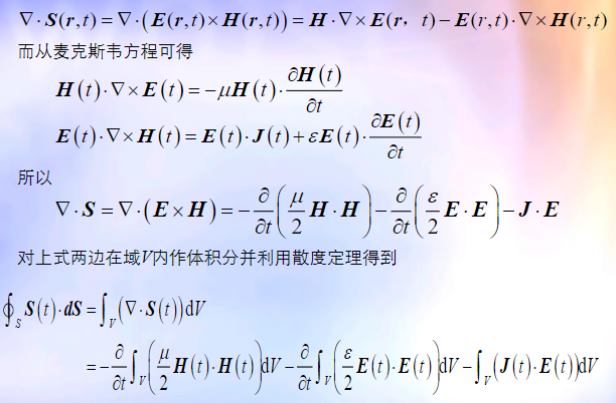
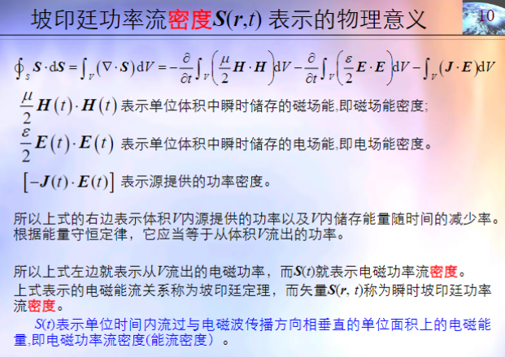
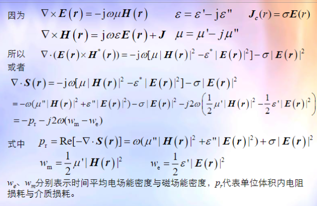
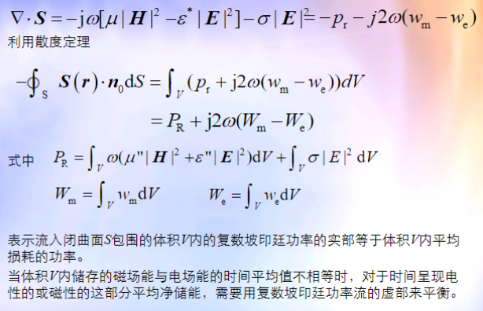

# 洛伦兹力

## 洛伦兹力方程

$$
F = q(E + v \times B)
$$

# 等离子体

等离子体是电离了的气体，含有大量带正电的离子和带负电的电子，可以自由移动。

## 等离子体分析模型

时谐电场作用于等离子体，等离子体中的电子和离子将受电场力作用而运动。因为电子质量比离子质量小得多，离子的运动可忽略，**电子将在平衡位置附近作简谐振动。**
电子离开平衡位置振荡，电子和离子的重心不重合，形成电偶极子。所以**时谐电场扰动下的等离子体可看成无限多振荡电偶极子的集合。**

## 等离子体单位体积中的电偶极距

时谐场作用于等离子体，电子受到的力

$$
F = eE
$$

设x为电子踢开正离子的位移，在电子作简谐振荡假定下

$$
F = m\frac{d^2x}{dt^2} = -m\omega^2x
$$

偶极矩密度P为

$$
P = -Nex = \frac{-Ne^2}{m\omega^2}E
$$

## 等离子体的等效介电常数

$$
D = \varepsilon_0 E +P= \varepsilon_0 (1-\frac{\omega_P^2}{\omega^2})E
$$

其中$\omega_P = \sqrt{\frac{Ne^2}{m\varepsilon_0}}$为等离子体频率。

等离子体可用一有效介电常数为

$$
\varepsilon_e = \varepsilon_0 (1-\frac{\omega_P^2}{\omega^2})
$$

的介质等效

# 坡印廷功率流

## 坡印廷矢量

$$
S = E \times H
$$

## 坡印廷功率流表示的物理意义

## 复数形式的坡印廷功率流

$$
S(r) = E(r) \times H^*(r)
$$

$$
<S(t)> = \frac{1}{2}Re(E(r) \times H^*(r))
$$

## 复数坡印廷功率流的物理意义

# 电磁场的几个基本原理和定理

## 叠加定理

## 唯一性定理

## 镜像定理

## 等效原理、电型源、磁型源

### 磁型源作用下的麦克斯韦方程

### 电的量和磁的量具有对偶性

## 互易定理