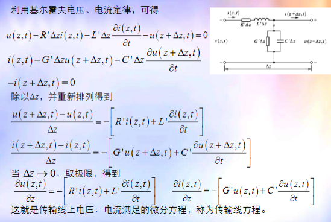
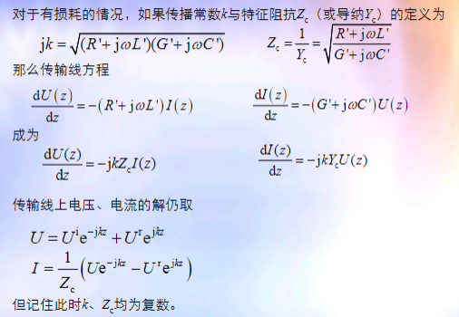

# 常用传输线及其场结构

平行双导线、同轴线、微带线都是常用的传输线，横向尺寸比波长小得多，纵向尺寸比波长大得多

电磁场都在横截面内，称为横电磁模

# 传输线

## 传输线在电路中相当于一个二端口网络

一个端口连接信号源，通常称为输入端；另一个端口连接负载，通常称为输出端

## 传输线上电压、电流是纵向位置z的函数

## 基尔霍夫定律分析传输线

把长度位l的传输线分成N段，每段长度$\Delta l<<\lambda$，基尔霍夫定律可以适用

# 传输线等效电路

## dz长度传输线等效电路

## 传输线的等效电路

## 平行双导线、同轴线的等效电路参数

# 传输线方程

## 复数形式的传输线方程

## 无损耗传输线方程的解

$$
R' = 0\quad G' = 0
$$

### 无损耗传输线方程的初步解释

## 有损耗传输线方程的解

# 传输线状态的表示

## 用电压电流表示

$$
\begin{cases}
    U(z) = U^ie^{-jkz}+U^re^{jkz}\\
    I(z) = \frac{1}{Z_c}(U^ie^{-jkz}+U^re^{jkz})
\end{cases}
$$

## 用入射波、反射波表示

$$
\begin{cases}
    U^ie^{-jkz} = \frac{1}{2}[U(z)+Z_cI(z)]\\
    U^re^{jkz} = \frac{1}{2}[U(z)-Z_cI(z)]
\end{cases}
$$

## 用反射系数表示

$$
\Gamma_u(z) = \frac{U^ie^{-jkz}}{U^re^{jkz}}
$$

## 用阻抗表示

$$
Z(z) = \frac{U(z)}{I(z)}
$$

$$
Z(z) = Z_c\frac{1+\Gamma_u(z)}{1-\Gamma_u(z)} = Z_c\frac{Z(0)-jZ_ctgkz}{Z_c-jZ(0)tgkz}
$$

## 反射系数与阻抗

$$
\Gamma_u(z) = \frac{Z(z)-Z_c}{Z(z)+Z_c}\\
Z(z) = Z_c\frac{1+\Gamma_u(z)}{1-\Gamma_u(z)}
$$

# 传输线的状态一般由负载$Z_L$决定

传输线状态取决于
- 始端激励($U^i,\omega$)
- 传输线特征参数($k,Z_c$)
- 终端负载($Z_L = R_L+jX_L$)

对于给定激励的传输线，其状态主要由终端负载决定

## 传输线状态与负载的关系
终端负载决定终端反射系数$\Gamma_u(0)$
根据反射系数的定义
$$
\Gamma_u(0) = \frac{U^re^{jkz}}{U^ir^{-jkz}} = \frac{U^r}{U^{-i}}e^{j2kz} = \Gamma_u(0)e^{j2kL}
$$
从而得到传输线的状态

## 由终端负载求传输线状态

## 电流反射系数与导纳

# 传输线状态用驻波系数与驻波最小点位置表示

波形最大值+最小值+初始相位

# 开路、短路、匹配时电压、电流分布

# 传输线上传输的功率

$$
P(z) = \frac{1}{2}Re[U(z)I^*(z)]\\
= \frac{1}{2}Re[U^i(1+\Gamma_u)\cdot\frac{U^{i^*}}{Z_c^*}(1-\Gamma_u)]
$$

## 无损传输线

对于无损传输线，通过线上任一点的传输功率时相同的。为了简便起见，一般取电压腹点或节点处计算

功率容量

$$
P_{br} = \frac{1}{2}\frac{|U_{br}|^2}{Z_c}
$$
$U_{br}$为线间击穿电压