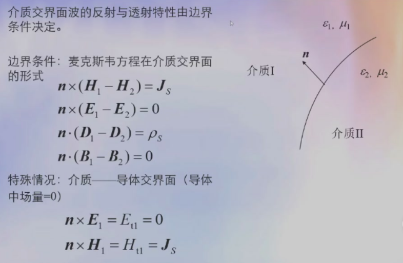
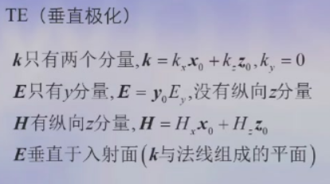
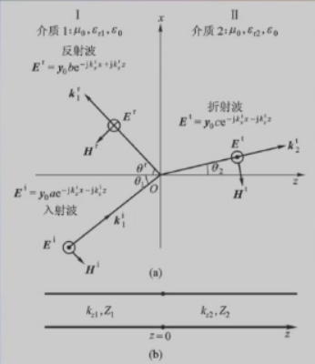
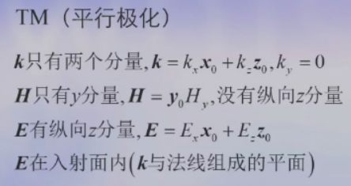
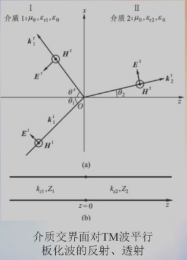

## 电磁波传输的传输线模型的条件与结论

![[Pasted image 20250402103753.png]]

# 反射与折射

## 波的反射与折射是研究不均匀介质中波传播的基本问题

不均匀介质中波的传播
- 将一维不均匀介质用多层均匀介质代替
- 每一层均匀介质中波的传播属于均匀介质中波传播的问题
- 介质交界面波的反射与透射

## 介质交界面波的反射、折射必须服从麦克斯韦方程

## 边界条件

## 介质交界面反射透射的两种情况

### TE（垂直极化）

定义反射系数$\Gamma = \frac{E_y^r}{E_y^i}$
定义透射系数$\Gamma = \frac{E_y^t}{E_y^i}$

### TM（平行极化）

定义反射系数$\Gamma = \frac{E_x^r}{E_x^i}$
定义透射系数$\Gamma = \frac{H_y^t}{H_y^i}$