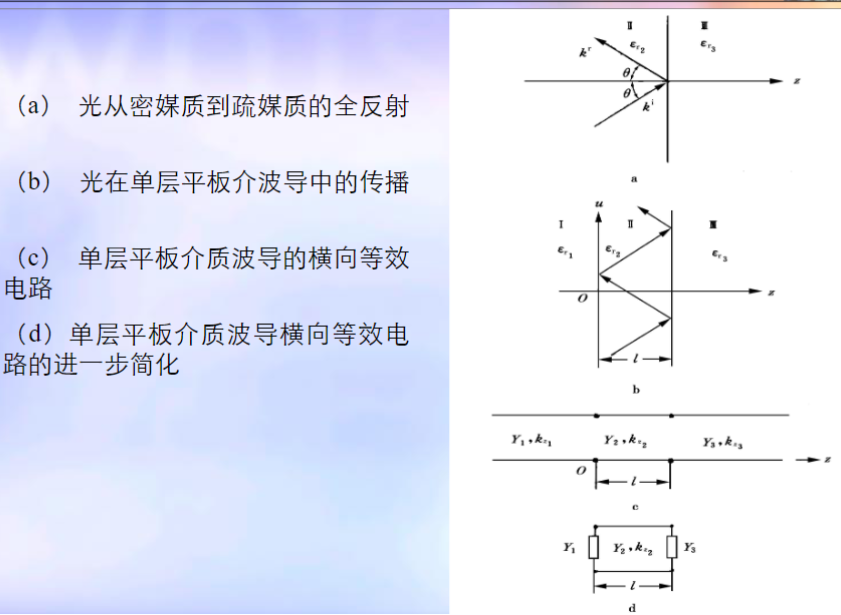
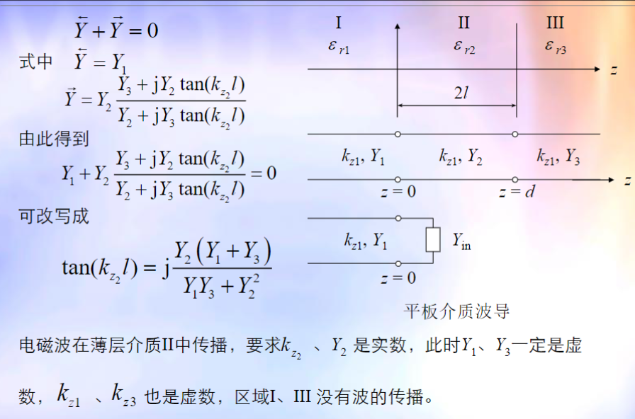
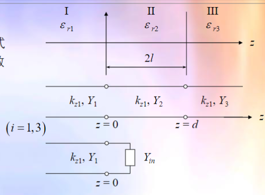
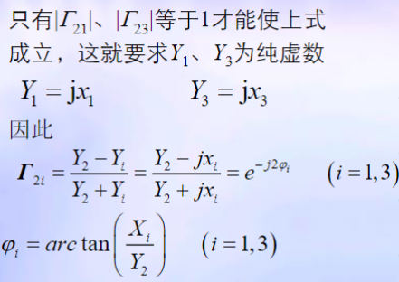
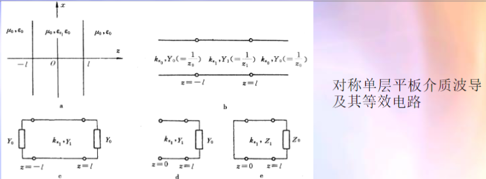
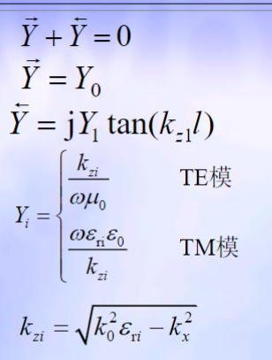

# 平板介质光波导导引电磁波的物理解释

- 导模层介电常数大于两旁的介电常数
- 入射角大于临界角，发生全内反射
- 内部区域来回反射以此相移为$2n\pi$

# 平板介质光波导

## 平面介质波导的横向谐振原理

## 横向谐振包含波限制在导膜中传播的充分必要条件

- $\varepsilon_{r2}>\varepsilon_{r1}，\varepsilon_{r2}>\varepsilon_{r3}$
- $\varphi_1 + \varphi_2 + k_{z_2}l = n\pi$

条件1保证介质Ⅱ与介质Ⅰ、Ⅲ分界面发生全反射，条件2保证导膜层内波来回反射一次总相移为$2n\pi$

## 对称单层平板介质光波导

偶对称对电压来说，对称面为波幅，相当于开路；奇对称对电压来说，对称面为波节，相当于短路

