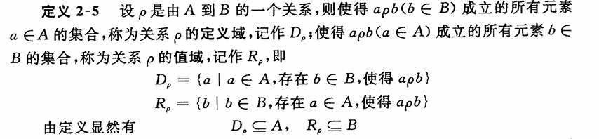

# 笛卡尔积

## 有序n元组

由n个具有给定次序的元素组成的序列

有序n元组相等的充要条件是它们对应的元素相等

## 笛卡尔积

设$A_1,A_2,......A_n$是任意集合，所有有序n元组的集合称为$A_1,A_2,......A_n$的笛卡尔积

$$
A_1 \times A_2 \times ...... \times A_n = \times_{i = 1}^nA_i\\
= \{(a_1,a_2,......,a_n) | a_1 \in A_1,a_2 \in A_2,......,a_n \in A_n\}
$$

笛卡尔积元素的数目是$\#A_1 \times \#A_2 \times ...... \times \#A_n$

## 笛卡尔积的运算规律

对二阶笛卡尔积可以证明有分配律成立

$$
A \times (B \cup C) = (A \times B) \cup (A \times C)\\
$$

交换律不成立

$$
A \times B \neq B \times A
$$

# 关系

n阶笛卡尔积$A_1 \times A_2 \times ...... \times A_n$的任一个子集p称为$A_1,A_2,......A_n$上的n元关系

## 定义域与值域

## 特殊关系

- 空关系，$p = \varnothing$
- 满关系，$p = A_1 \times A_2 \times ...... \times A_n$‘
- 恒等关系，$p = \{(a,a) | a \in A\}$
- 普遍关系，$p = \{(a_i,a_j) | a_i \in A,a_j \in A\}$

## 逆关系

若 p是A到B的关系，则B到A的关系称为p的逆关系

$$
\widetilde{p} = \{(b,a) | (a,b) \in p\}
$$

## 关系的表示方法

- 图示
- 矩阵
- 关系图