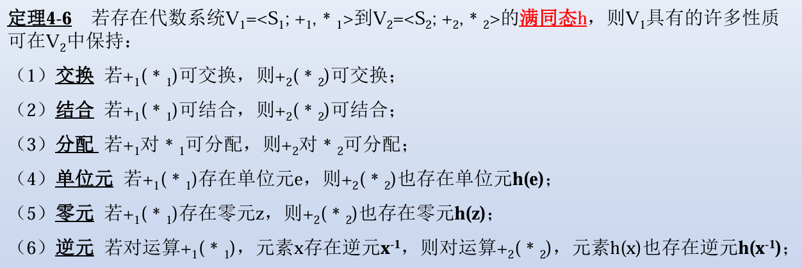

# 运算

## 定义

非空集合A，函数$f:A^n \rightarrow A$称为A上的n元运算，n称为运算的阶

## 运算的性质

设*为A上的一个运算

- 封闭性：$f:A^n \rightarrow B,B \subseteq A$
- 交换性：$a*b=b*a$
- 结合性：$(a*b)*c=a*(b*c)$
- 分配性：$a*(b+c)=a*b+a*c$

当运算*可结合时，可表示为$a*b*c=a*(b*c)$

有幂运算

$$
a^1 = a \\
a^{n+1} = a^n * a
$$

## 运算元

### 单位元

- 左单位元：$e*a=a$
- 右单位元：$a*e=a$
- 单位元：$e*a=a*e=a$

对于运算*，若存在$e \in A$，使得对于任意$a \in A$，有$e*a=a*e=a$，则称e为*的单位元

如A上的运算*同时存在左单位元$e_l$和右单位元$e_r$，则
$$
e_l=e_r = e
$$
且e是A上关于*的唯一单位元

### 零元

- 左零元：$z_l*a=z_l$
- 右零元：$a*z_r=z_r$
- 零元：$z*a=a*z=z$

如果A上的运算*存在左零元$z_l$和右零元$z_r$，则
$$
z_l=z_r=z
$$
且z是A上关于*的唯一零元

### 幂等元

对于运算*，若$a*a=a$，则称a为幂等元
对于幂等元a，有
$$
a^n = a
$$

### 逆元

- 左逆元：$a_l^{-1}*a =e$
- 右逆元：$a*a_r^{-1}=e$
- 逆元：$a^{-1}*a=a*a^{-1}=e$

设*是A上具有单位元e的运算，且是可结合的,对元素$a \in A$，若存在左逆元$a_l^{-1}$和右逆元$a_r^{-1}$，则
$$
a_l^{-1}=a_r^{-1}=a^{-1}
$$
且$a^{-1}$是a的唯一逆元

### 单位元与零元

设*是A上的二元运算，且#A>1，若*有单位元e和零元z，则$e \not = z$

# 代数系统

非空集合和定义在该集合上的一个和多个运算所组成的系统称为代数系统，用记号$<S;O_1,O_2 \cdots,O_n>$表示

代数系统的基数：非空集合的基数
有限代数系统：基数有限的代数系统

子代数系统：设$<S;O_1,O_2 \cdots,O_n>$是一个代数系统，若$S_1 \subseteq S$，且$<S_1;O_1,O_2 \cdots,O_n>$是一个代数系统，则称$<S_1;O_1,O_2 \cdots,O_n>$是$<S;O_1,O_2 \cdots,O_n>$的子代数系统

## 整环

若代数系统$<J;+,\cdot>$满足以下条件，则称J是整环
- 交换律
- 结合律
- 分配律
- 有单位元
- +可逆
- 削去律

# 同态和同构

## 同态

设$<S;O_1,O_2 \cdots,O_n>$和$<T;O_1',O_2' \cdots,O_m'>$是两个代数系统，若存在一个映射$f:S \rightarrow T$，使得对于任意$a,b \in S$，有
$$
f(a O_i b) = f(a) O_i' f(b)
$$
则称f是从$<S;O_1,O_2 \cdots,O_n>$到$<T;O_1',O_2' \cdots,O_m'>$的同态,后一个代数系统称为前一个代数系统的同态像

## 同构

设h是$V_1$到$V_2$的同态
- h是单射，称h为单同态
- h是满射，称h为满同态
- h是双射，称h为同构

若h是$V_1$到$V_2$的同构，则h的逆映射$h^{-1}$是$V_2$到$V_1$的同构，称$V_1$和$V_2$彼此同构