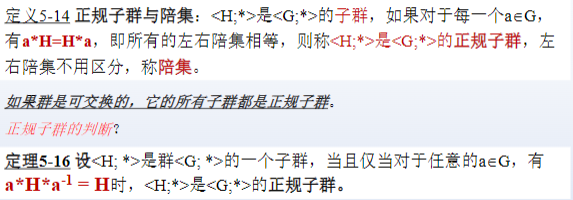

# 半群和独异点

## 半群

对代数系统$<S;*>$,若运算*是可结合的，则该代数系统称为半群

代数系统：封闭性
半群：封闭性，结合性

## 独异点

独异点：对半群$<S;*>$，若运算*存在单位元，则称该半群为独异点
可特别定义
$$
a^0 = e
$$

交换独异点：对独异点$<S;*>$，若运算*是可交换的，则称该独异点为交换独异点

循环独异点：对独异点$<S;*>$，若存在$g \in S$，使得每一个元素$a \in S$都可以表示为
$$
a = g^i
$$

对循环独异点$<S;*>$,S可表示成$S = \{e,g,g^2,.....g^i,.....\}$

### 循环独异点的性质
- 所有循环独异点都是可交换的
- 若$<S;*>$是有限循环独异点，则必存在正整数n和m，m<=n,使得$g^n = g^m$
- 有限循环独异点至少有一个除单位元e以外的幂等元

推论：设$<S;*>$是一有限独异点，则对每个$a \in S$,存在$j>=1$,使得
$$
a^j*a^j = a^j
$$

## 子半群与子独异点

生成子：半群$<S;*>$,$T\subseteq S$.若S中任意元素均可由T中的元素经运算表达出来，称T是$<S;*>$的生成子

# 群

## 群的定义

群是一个代数系统$<G;*>$，满足以下四个条件：
1. 封闭性：对任意$a, b \in G$，有$a * b \in G$。
2. 结合性：对任意$a, b, c \in G$，有$(a * b) * c = a * (b * c)$。
3. 单位元：存在一个单位元$e \in G$，使得对任意$a \in G$，有$a * e = e * a = a$。
4. 逆元：对任意$a \in G$，存在一个逆元$a^{-1} \in G$，使得$a * a^{-1} = a^{-1} * a = e$。

若群$<G;*>$的运算*是可交换的，则称$<G;*>$为交换群或阿贝尔群。

**独异点若对每个元素都存在逆元，则该独异点称为群**

- 半群：封闭性，结合性
- 独异点：封闭性，结合性，单位元
- 群：封闭性，结合性，单位元，逆元

# 群的基本性质

# 子群及陪集

## 子群的定义

设$<G;*>$,$<H;*>$是群，$H$是$G$的一个非空子集，则称$<H;*>$为$<G;*>$的一个子群。

判定子群的条件：
1. H中的任意元素都存在逆元
2. $H$包含单位元$e$。

## 陪集

$<H;*>$是$<G;*>$的子群，$a \in G$，则
- $H*a = \{h*a|h∈H\}$称为右陪集
- $a*H = \{a*h|h∈H\}$称为左陪集

若$a\in H,H*a = a*H =H$，H既是左陪集，又是右陪集

## 正规子群

## 相关定理

