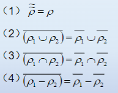
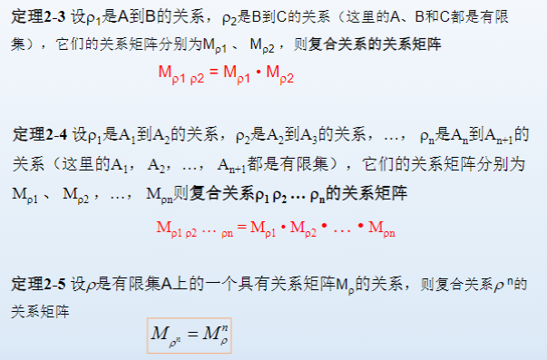

# 关系的复合

## 关系逆运算的性质

逆运算：有序对倒置$\overline{(a,b)}= (b,a)$

$$
\overline{\rho_1-\rho_2} = \overline{\rho_1} - \overline{\rho_2}\\
\overline{A \times B} = B \times A
$$

## 关系的复合运算

$\rho_1$是从A到B的关系，$\rho_2$是从B到C的关系，$\rho_1 \cdot \rho_2$是从A到C的关系,定义为当且仅当

$$
\rho_1 \cdot \rho_2 = \{(a,c) | \exists b \in B,(a,b) \in \rho_1,(b,c) \in \rho_2\}
$$

## 关系复合的定理

$$
I_A \cdot \rho = \rho \cdot I_B = \rho
$$

$$
(\rho_1 \cdot \rho_2)\cdot \rho_3 = \rho_1 \cdot (\rho_2\cdot \rho_3)
$$

# 复合关系的关系矩阵和关系图

设$\rho_1=r_{ij}^{(1)}、\rho_2=r_{ij}^{(2)}$是A到B的关系

这里的矩阵相乘表示各对应项相乘

## 关系矩阵与关系的复合运算

**关系复合的矩阵运算中，将普通加法改为布尔加，普通惩罚改为布尔乘**

# 关系的性质与闭包运算

## 自反与反自反、非自反

$$
\forall a \in A,(a,a) \in \rho \Rightarrow \rho 自反，否则非自反\\
\forall a \in A,(a,a) \notin \rho \Rightarrow \rho 反自反
$$

自反关系的关系矩阵中对角线元素均为1；反自反关系的关系矩阵中对角线元素均为0

## 对称、反对称、非对称

$$
\forall (a,b) \in \rho, (b,a) \in \rho\Rightarrow \rho 对称，否则非对称\\
a \not ={b},\forall (a,b) \in \rho, (b,a) \notin \rho\Rightarrow \rho 反对称
$$

若关系既是对称的，又是反对称的，必有对角线外的元素都为0

## 传递性

$$
若(a,b),(b,c)\in \rho ，则(a,c)\in \rho\Rightarrow \rho 可传递，否则不可传递
$$

不违反以上规则则是可传递的

# 闭包

# 等价关系

如果一个关系是**自反的、对称的、可传递的**，则称为**等价关系**

恒等关系和满关系都是等价关系
同余关系也是等价关系

若$\rho$是等价关系，可以证明
$$
\rho^n = \rho
$$

若关系是自反的、对称的，称为相容关系

# 偏序

偏序关系：自反的、反对称的、可传递的

## 全序与良序

