# 偏序集

在集合 \( L \) 上定义的偏序关系 \( \leq \) 和集合 \( L \) 合称为偏序集

偏序集有如下性质
- 自反性
- 反对称性
- 传递性

## 上下界

- 下界：$a\leq l_1,a\leq l_2$，称a为\( l_1,l_2 \) 的下界
最大下界：$glb = max\{l_1,l_2的下界\}$

- 上界：$l_1\leq a,l_2\leq a$，称a为\( l_1,l_2 \) 的上界
最小上界：$lub = min\{l_1,l_2的上界\}$

下界和上界不是唯一的，但最大下界和最小上界是唯一的

## 最大最小元

- 最大元：\( a \) 是偏序集 \( L \) 的最大元，如果对于任意的 \( l \in L \)，都有 \( l \leq a \)
- 最小元：\( a \) 是偏序集 \( L \) 的最小元，如果对于任意的 \( l \in L \)，都有 \( a \leq l \)

最小元和最大元可能不存在，若存在，则是唯一的

# 格及其性质

## 定义

一个偏序集 \( <L ;\leq>\)，对于任意的 \( a,b \in L \)，都有最大下界和最小上界，则称该偏序集为格

记
- 最大下界：glb = \( a \wedge b \)，称为交运算
- 最小上界：lub = \( a \vee b \)，称为并运算

## 性质

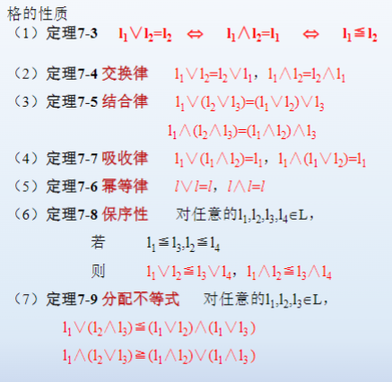

对偶性原理：
$\vee \Leftrightarrow \wedge , \leq \Leftrightarrow \geq$

# 格是一种代数系统

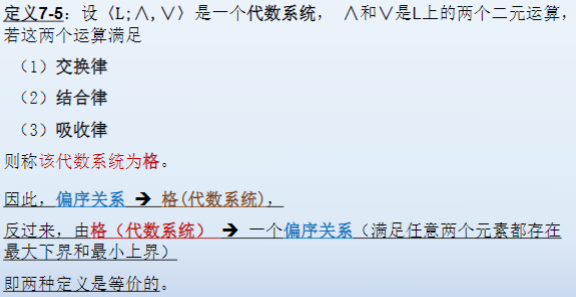

## 子格

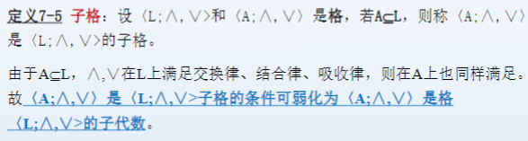

## 分配格和有补格

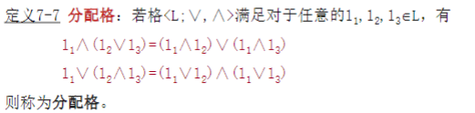
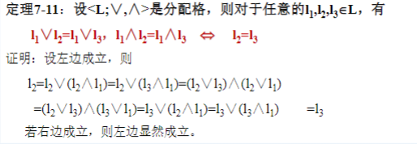
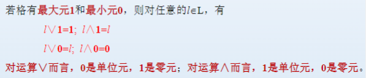

若一个格既是分配格又是有补格，则称为有补分配格

补元的唯一性：有补分配格任意元素的补元是唯一的

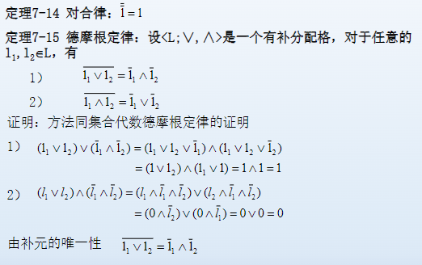

# 布尔代数

布尔代数：有补分配格，记为$<B;-,\vee,\wedge>$

## 性质

- 交换律：$a\vee b = b\vee a$，$a\wedge b = b\wedge a$
- 结合律：$a\vee(b\vee c) = (a\vee b)\vee c$，$a\wedge(b\wedge c) = (a\wedge b)\wedge c$
- 等幂律：$a\vee a = a$，$a\wedge a = a$
- 吸收律：$a\vee(a\wedge b) = a$，$a\wedge(a\vee b) = a$
- 分配律：$a\wedge(b\vee c) = (a\wedge b)\vee(a\wedge c)$，$a\vee(b\wedge c) = (a\vee b)\wedge(a\vee c)$
- 同一律：$a\vee 0 = a$，$a\wedge 1 = a$
- 零一律：$a\vee 1 = 1$，$a\wedge 0 = 0$
- 互补律：$a\vee(-a) = 1$，$a\wedge(-a) = 0$
- 对合律：$-(-a) = a$
- 德摩根律：$-(a\vee b) = -a\wedge-b$，$-(a\wedge b) = -a\vee-b$

## Hangtington公理

设B是任意集合，若在B上定义运算$-,\vee,\wedge$满足下面性质，则称$<B;-,\vee,\wedge>$为布尔代数

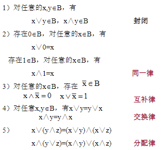

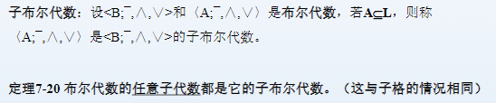

# 有限布尔代数的同构

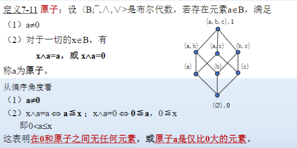
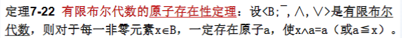

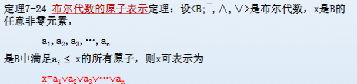

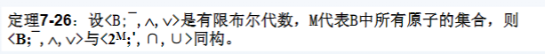

# 布尔表达式和布尔函数

## 最小项

$$
\hat{x_1}\wedge\hat{x_2}\wedge\cdots\wedge\hat{x_n}
$$

## 最大项

$$
\hat{x_1}\vee\hat{x_2}\vee\cdots\vee\hat{x_n}
$$