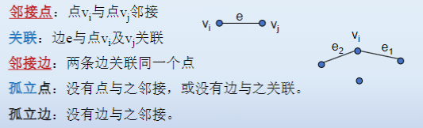
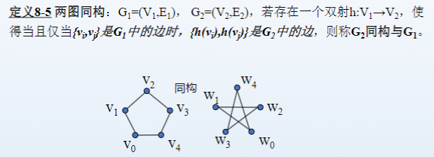

# 图论基本概念

## 图

设V是一个非空有限集合，E是V上的一个二元关系，则有序二元组$G = (v,E)$称为图，V称为结点集，E称为边集。

$$
(n,m)图：\#V = n, \#E = m;零图(n,0)，平凡图(1,0)
$$

## 完全图

任意两点都是邻接的（任意两点都有边相连）.N格结点的完全图记为$K_n$

完全图的边数结点数关系:$m = C_n^2 = \frac{n(n-1)}{2}$

## 补图

由G的所有结点和为了使图G成为完全图所需添加的所有边构成的图，记为$\overline{G}$

图与补图的边集互为补集

## 结点度

与一个点$v_i$相关联的边数，记为$deg(v_i)$

对(n,m)图，有

$$
\sum_{i=1}^n deg(v_i) = 2m
$$

## 正则图

所有结点的度相同，称为正则图。若度为d，称为d次正则图。

## 子图

称$G_2$是$G_1$的子图，记为$G_2 \subseteq G_1$
$$
G_1 = (V_1,E_1),G_2 = (V_2,E_2)，V_2 \subseteq V_1, E_2 \subseteq E_1
$$

- 真子图：$V_2 \subseteq V_1, E_2 \subset E_1$
- 生成子图：$V_2 = V_1, E_2 \subseteq E_1$

## 两图同构

