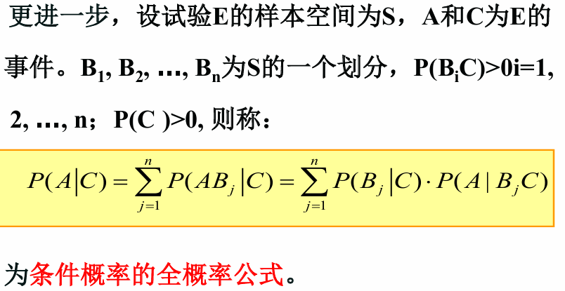
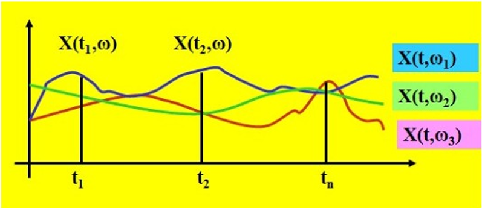
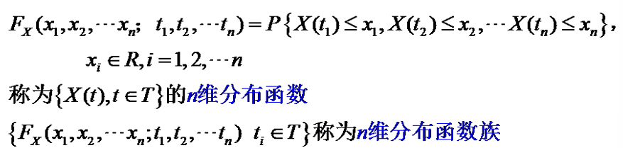
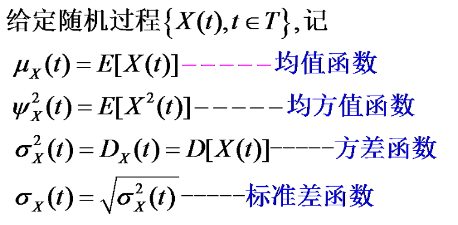
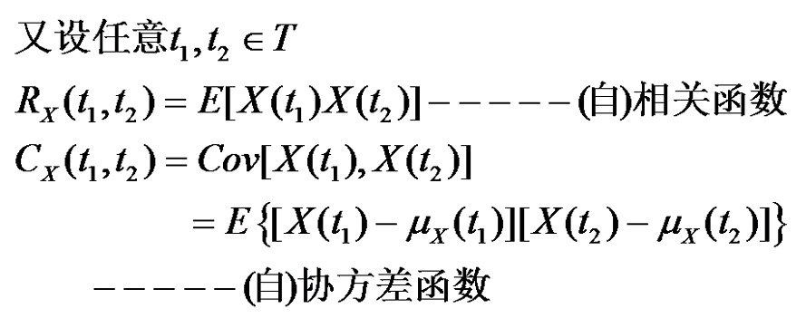
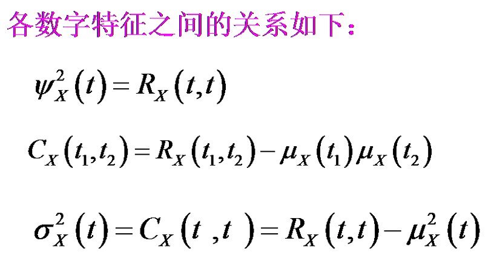
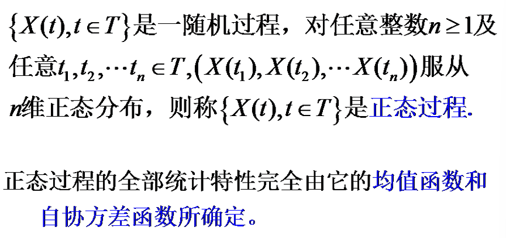
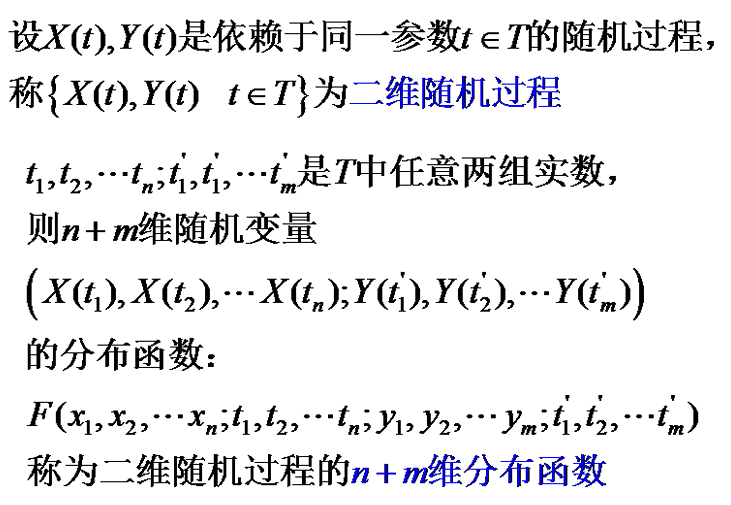
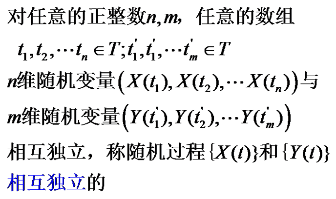

# 概率论公式

$$
P(A_1A_2...A_n) = P(A_1)P(A_2|A_1)P(A_3|A_1A_2)...P(A_n|A_1A_2...A_{n-1})
$$

$$
P(A_1A_2...A_n|B) = P(A_1|B)P(A_2|A_1B)P(A_3|A_1A_2B)...P(A_n|A_1A_2...A_{n-1}B)
$$

# 随机过程

## 定义

设S是样本空间，T为一参数集，$\{X(t);t \in T\}$是S上的随机过程

## 状态及状态空间

- $X(t)$表示在t时刻过程所处的状态
- 所有可能的状态取值所构成的集合称为随机过程的状态空间

## 样本函数

$\{X(t);t \in T\}$可以看成定义在$T\times S$上的二元函数

- $X(t,\cdot)$是随机变量
- $X(\cdot,s)$是样本函数

# 随机过程的有限维分布

## 有限维分布函数族

$\{F_x(x,t),t \in T\}$称为一维分布函数族

# 特征函数

## 二阶矩过程

随机过程$\{X(t);t \in T\}$是二阶矩过程，如果对任意的t1,t2,...,tn，$E[X^2(t_i)]$存在

## 随机相位余弦波的特征函数

$X(t) = a\cos(wt+\theta)$

- 均值函数$\mu_x(t) = 0$
- 自相关函数$R_x(t_1,t_2) = \frac{a^2}{2}\cos w(t_2-t_1)$
- 方差函数$\sigma_x(t) = \frac{a^2}{2}$

# 正态过程

# 两个随机过程之间的关系

互相关函数：
$$
R_{xy}(t_1,t_2) = E[X(t_1)Y(t_2)]
$$
$$
R_{yx}(t_1,t_2) = E[Y(t_1)X(t_2)]
$$

互协方差函数：
$$
C_{xy}(t_1,t_2) = E[X(t_1)Y(t_2)] - \mu_x(t_1)\mu_y(t_2)
$$
$$
C_{yx}(t_1,t_2) = E[Y(t_1)X(t_2)] - \mu_y(t_1)\mu_x(t_2)
$$

如果对任意的t1,t2，$C_{xy}(t_1,t_2) = 0$，则称两个随机过程是不相关的