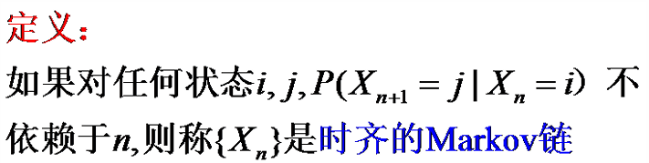
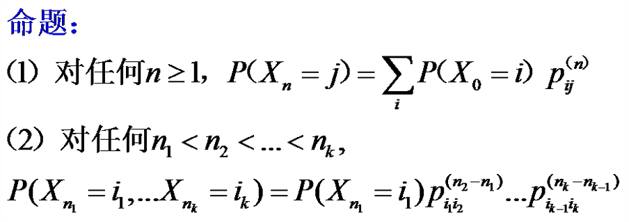

# 马尔可夫性

$$
P(X_n=x_n|X_{n-1}=x_{n-1},X_{n-2}=x_{n-2},\cdots,X_0=x_0)=P(X_n=x_n|X_{n-1}=x_{n-1})
$$

设A为过去事件，B为现在事件，C为将来事件

$$
P(C|AB)=P(C|B)
$$

## 马尔可夫链

如果$\{X_n;n = 0,1,2 \cdots\}$是咋黄台离散的随机过程，并且具有马尔可夫性，则称为马尔可夫链

# 转移概率、转移矩阵

$$
P(X_{n}=j|X_m=i)=p_{ij}(m,n)
$$

从处于状态i的m转移到处于状态j的n的转移概率

## 性质

$$p_{ij}(m,n)>0 ; \sum_{j \in I}p_{ij}(m,n) = 1$$

## 一步转移概率

$$
p_{ij}:=P(X_{n+1}=j|X_{n}=i)
$$

## n步转移矩阵

$$
(p_{ij}(m,m+n))_{I \times I}
$$

各个元素非负，各行相加为1

从行转移到列

# C-K方程

$$
p_{ij}(s,s+u+v) = \sum_{k \in I}p_{ik}(s,s+u)p_{kj}(s+u,s+u+v)
$$

实际上就是马尔可夫链下的全概率公式

转为转移矩阵的形式，即i到j的转移矩阵等于i到k的转移矩阵乘以k到j的转移矩阵

$\Rightarrow$n步转移矩阵为一步转移矩阵的n次方

# 常返和暂留

## 定义

$$
\tau_i = min\{n \geq 1|X_n = i\}
$$

- 常返: $P(\tau_i < \infty|X_0 = i) = 1$
- 暂留: $P(\tau_i < \infty|X_0 = i) < 1$

## 正常返和零常返

- 正常返: $\mu_i = E(\tau_i|X_0 = i) < \infty$
- 零常返: $\mu_i = E(\tau_i|X_0 = i) = \infty$

设
$$
f_{ij}^{(n)} = P(X_n = j,X_{n-1}\not =j,\cdots,X_1 \not ={j}|X_0 = j)
$$
$$
f_{ij} = P(\tau_j < \infty|X_0 = i) = \sum_{n=1}^{\infty}f_{ij}^{(n)}
$$
$$
\mu_i = \sum_{n=1}^{\infty}nf_{ii}^{(n)}
$$
